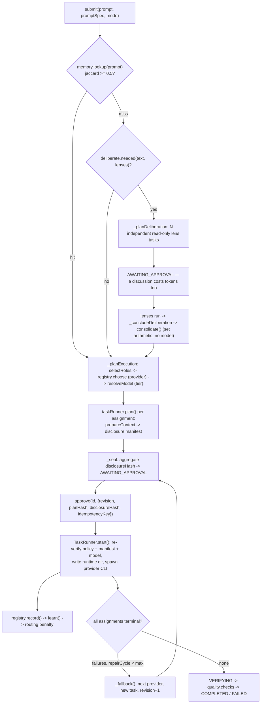

# BigKiji Universe — Architecture Reference

Derived by reading the source under `app/` (version 2.5.0, `package.json`). Every claim cites the file it
came from. Paths are relative to `app/`.

---

## 1. Process topology

| Process | Entry | Lifetime | Owns |
|---|---|---|---|
| Electron main | `src/core/main.js` (`package.json` `"main"`) | menu-bar resident | tray, windows, PTY, TTS, IPC, in-app fallback orchestrator |
| Renderers | `src/components/UI/*.html` | per window | Three.js canvas, xterm terminal, audio, settings |
| Standalone daemon | `src/domain/server/daemon.js` | detached, survives app restarts | sessions, ideas, runs, mobile PWA, HTTP/SSE/WS on 8777 |
| Provider CLIs | spawned by `TaskRunner.start()`, `src/domain/pi-agent/task-runner.js` | one task, never resident | the actual paid work |

### Electron main

`app.whenReady()` in `src/core/main.js` builds the tray (`createTray()` — `new Tray(nativeImage.createEmpty())`,
`tray.setTitle('❖')`), the tray window, and — only under `SMOKE`/`SNAP`/`--show-main` — the main window.
On macOS it calls `app.dock.hide()` (line 1392) unless one of those flags is set, so the normal state is
menu-bar-only. `app.on('window-all-closed')` deliberately does nothing and both windows' `close` handlers
`preventDefault()` and hide. A single-instance lock (`app.requestSingleInstanceLock()`) makes a second
`npm start` just toggle the tray window.

It also spawns a login shell via `node-pty` (`spawnShell()`), degrading to a plain `child_process.spawn`
pipe if `node-pty` fails to load; the resulting mode (`'pty' | 'pipe'`) is reported in `get-info` and the
SMOKE line.

### Windows

| File | Window | Notes |
|---|---|---|
| `src/components/UI/tray.html` | tray popover | 350×680, `frame:false`, `transparent:true`, `alwaysOnTop`, `backgroundThrottling:false`; draws its own tray icon and returns it via `tray:render` |
| `src/components/UI/main.html` | Synapse Canvas | 1280×840, `titleBarStyle:'hiddenInset'` |
| `src/components/UI/setup.html` | first-run wizard | 780×600, `resizable:false`, deliberately opaque — `createSetupWindow()` says this avoids the `backdrop-filter`-vs-vibrancy conflict |
| `src/components/UI/remote/mobile.html` | phone PWA | **not** an Electron window; served by the daemon at `/` (`staticFiles` in `startDaemon`) |

All windows share one preload with `contextIsolation: true, nodeIntegration: false`.

### contextBridge surface

`src/core/preload.js` exposes exactly one global, `window.bigkiji` (~115 members), and no raw
`ipcRenderer`. Groups: bus/PTY (`onBusEvent`, `ptyInput`, `ptyResize`), vault view (`onVaultFiles`,
`onVaultTouch`, `fileDetail`, `reveal`), voice (`liveToggle`, `liveUtterance`, `onTtsChunk`,
`voiceInterrupt`, `ttsPreview`), orchestration (`planTask`, `prepareTasks`, `approveTask`, `listRuns`,
`approveRun`, `abortRun`, `onRunEvent`), conversation/ideas (`conversationTurn`, `enhanceIdea`,
`planIdea`, `promoteIdea`), setup/tools/workspaces (`setupState`, `setupApply`, `toolsDetect`,
`workspaceState`, `workspaceRegister`, `onWorkspaceChanged`), and misc (`remoteAccess`, `previewStart`,
`comfyGenerate`, `buildTaskReport`, `openExternal`).

`openExternal` is the only outward-facing call and rejects anything not `http(s)`. `reveal` and
`file:detail` both refuse paths outside the vault (`isInside(VAULT, p)`; `absolute.startsWith(root)`).

### The daemon, and why it exists

`src/domain/server/daemon.js` is a plain-Node HTTP server on `127.0.0.1:8777` (`loadConfig()`).
`DaemonClient.ensure()` (`src/domain/server/daemon-client.js`) probes `/health` and, if nothing answers,
spawns the daemon `detached: true, stdio: 'ignore'` with `ELECTRON_RUN_AS_NODE=1` (`daemonSpawnEnv`) so it
runs headless instead of as a second Electron app.

State that must outlive the UI lives there:

* **Sessions** — append-only JSONL under `sessionsRoot` (`SessionStore`; asserted in `tools/daemon-selftest.js`).
* **Idea drafts** — `IdeaDraftStore`, hash-guarded (`STALE_IDEA_DRAFT`).
* **Runs** — the daemon owns its own `CoreExecutionCoordinator` and `TaskRunner` (`maxParallel: 3`).
* **The phone** — `staticFiles` serves the PWA, manifest, service worker, icons and a vendored
  `three.module.js`; `/api/voice` accepts a 16 kHz mono WAV body and runs the same two-pass Whisper
  pipeline as the desktop (`src/domain/server/speech-to-text.js`); `/assets/*` + `/api/assets` stream
  generated media out of `PATHS.generatedMediaRoot` with a fixed `ASSET_TYPES` map, a resolved-path
  containment check, `nosniff`, and HTTP Range support.

The Electron app is a **client** when connected: `piSendPrompt`, `task:list`, `run:list`, `session:*`,
`idea:*` and `pi:abort` in `src/core/main.js` all branch on `daemonClient?.connected` and fall back to the
in-process `taskRunner`/`coordinator`. Daemon SSE/WS events are re-broadcast onto renderer IPC channels via
`channelMap` in `app.whenReady()`. Port 8777 belongs exclusively to the daemon; main.js never opens a
second listener (comment at line 1431).

### Where state lives

| State | Home |
|---|---|
| Sessions, ideas, runs, security counters | daemon process + `sessionsRoot`/`ideasRoot` on disk |
| Provider secrets | `SettingsStore` (Electron `safeStorage`), pushed to the daemon via `/api/security/credentials`; the daemon holds them in an in-memory `Map` only |
| Routing / quality / audio preferences | `<userData>/settings.json` (`src/core/settings-store.js`) |
| Routing lessons, capability priors | `model_capabilities.json`, `model_performance.json` under `knowledgeRoot` |
| Deliberated plans | `deliberation_memory.json` under `knowledgeRoot` |
| Canvas, terminal, audio state | renderer only |

---

## 2. Data root resolution

`src/core/data-root.js` is the single source of truth and is deliberately pure Node — its header forbids
`require('electron')` because Electron main, the daemon and the CLI all load it.

**Order** (`resolveDataRoot()`):

1. `env.BIGKIJI_DATA_ROOT` → `source: 'env'`. This is also how main tells its children: `main.js:19` sets
   `process.env.BIGKIJI_DATA_ROOT = PATHS.dataRoot` before any other require, and `daemonSpawnEnv()`
   forwards it.
2. `<userData>/data-root.json` → `source: 'pointer'`, written by the setup wizard (`writePointer`).
3. `~/BigKijiUniverse` → `source: 'default'` (`defaultDataRoot()`).

`writeJsonAtomic()` writes a temp file, `fsync`s, then renames — a truncated pointer means losing track of
the owner's data.

**Layout** (`dataLayout(dataRoot, overrides)`):

```
<dataRoot>/
  bigkiji-data.json                    ROOT_MARKER
  state/    system_memory.json · remote.json · daemon.pid
            mobile-devices.json · cli-config.json
  sessions/  ideas/  logs/  reports/  knowledge/  recordings/
  generated-media/  cache/tts/  models/  migrations/
```

`overrides` (per-key absolute paths) is what makes **reference mode** work: nothing moves and every root
resolves to where the data already is. `stateAt()` exists because the legacy CLI config is `config.json`,
not `cli-config.json`, so a `stateRoot` override alone is insufficient.

`src/core/path-config.js` layers app paths on top (`uiRoot`, `vaultRoot`, `graphPath`, tool binaries) and
spreads `layout` *first* so its explicit keys win. `detectVault()` no longer hardcodes a personal path — it
uses `findVaultCandidates()`, which treats any directory containing `.obsidian/` as a candidate.
`whisperModel` / `ttsVenvPython` probe both the new home and legacy `~/.bigkiji`, keeping a 465 MB model
and a 1.4 GB venv working with zero movement. First-run detection is `setup-state.json`, **not** "does
dataRoot exist" — a half-failed migration would otherwise strand the owner outside the wizard
(`setupStatus()`). `SMOKE`/`SNAP`/`BIGKIJI_SKIP_SETUP=1` yield `kind: 'suppressed'`, and `main.js:28` only
calls `ensureLayout()` when setup is `'done'` or the root came from env/pointer, so a smoke run never
leaves a stray `~/BigKijiUniverse`.

### Migration

`src/core/migration-plan.js` is a **pure planner** (stat only, zero side effects) so the wizard preview and
the run can never disagree. It is a whitelist, not "move `~/.bigkiji`", because that directory also holds
the owner's unrelated shell automation.

`src/core/data-migrator.js` executes it. Transactional model, per its header:

* Manifest written **before** any mutation, re-saved after every state change (`manifestFile()`, `save()`).
* Same volume → `fs.rename`, atomic per entry.
* Cross volume → `EXDEV`/`EPERM`/`ENOTEMPTY` falls through to `mergeCopy` → `verifyCopy` → `digestFile` →
  `removeCopiedSources`. Resumable rather than atomic.
* Source deleted **strictly last** — that is what keeps `rollbackMigration()` always possible.
* Pointer and `settings.paths.*` written last of all (`ipcMain.handle('setup:apply')`), so a crash at any
  point leaves the app reading the legacy locations.

**What the migrator refuses to move, and why:**

| Refusal | Where | Stated reason |
|---|---|---|
| dataRoot inside the Obsidian vault | `preflight()` | the app scans the vault and would index its own state |
| src/dst overlap | `preflight()` | corrupts the copy |
| < 1.2× total bytes free | `preflight()` | the copy path needs source and destination to coexist |
| `~/.pi/agent/knowledge/bigkiji-universe` | `copyOnly: true` in `entryTable()` | `~/.pi` belongs to the `pi` CLI; merged as a copy, original left in place |
| TTS venv (default OFF, `group: 'models'`) | `warning` field | a virtualenv bakes absolute paths into `pyvenv.cfg`, `bin/python` and every shebang; moving it breaks TTS silently |
| Files the merge skipped (destination newer) | `mergeCopy` / `removeCopiedSources` | their contents were never carried across; deleting them would discard the owner's older revision and make rollback inexact |

Hashing is full `sha256` below 32 MB and a head/middle/tail **sampled** digest above it — and the manifest
records `algo: 'sampled'` so it is not mistaken for a full hash (`digestFile()`).

`stopDaemonForMigration()` in `main.js` quiesces the daemon first (POST `/api/shutdown`, poll `/health`
16×, SIGTERM the PID file at attempt 12): macOS has no mandatory locks, so the hazard is not the rename
but a write landing in the old location afterwards.

---

## 3. Workspace registry

`src/core/workspace-registry.js`. The model, in its own words, follows what Obsidian / VS Code / Zed /
Docker Desktop actually do:

* **Flat, explicit registration.** `candidates()` only *proposes*; `register()` is the only writer.
  `tools/workspace-registry-selftest.js` pins this ("proposing a candidate must not register it").
* **Registry lives in the app's own data directory** (`<userData>/workspaces.json`), never inside the
  folders it points at, so it survives one of them being deleted or unmounted.
* **Overlap refused**, not silently double-counted: `register()` throws `Overlaps an existing workspace`
  in both nesting directions. Re-registering the same path is an update, not an overlap.
* **Per-root excludes from the start** (`DEFAULT_EXCLUDE`: `node_modules`, `.git`, `.next`, `dist`,
  `build`, `graphify-out`, `_archive`, `recordings`, `venv`, `.venv`, `__pycache__`, `Pods`). Setting
  `exclude` explicitly **replaces** the defaults (asserted in the selftest).
* **A vanished root is reported, never re-pointed.** `statusOf()` separates `missing` (ENOENT) from
  `unreadable` (EPERM/EACCES — a re-grant problem, not a re-pick problem).
* **`allows(target)` is the single gate** — inside a registered, readable root and not excluded.
* **Env override** `BIGKIJI_WORKSPACES` (comma-separated) replaces the registry entirely so a test run
  cannot mutate the real one; `list()` marks those entries `overridden: true`.

`src/core/main.js` instantiates it against `PATHS.userData` and exposes CRUD over IPC
(`workspace:state|register|remove|update|choose`, broadcasting `workspace:changed`), surfaced in
`src/core/preload.js` (`workspaceState`, `workspaceRegister`, `workspaceChoose`, `onWorkspaceChanged`) and
rendered by `src/components/UI/settings-modal.js`. `workspaceState()` proposes candidates from
`~/Documents` and `~`, minus anything already registered.

Registration is what grants access. `scanRoots()` in `src/core/main.js` returns the registered
roots — falling back to the single vault root when none are registered, so behaviour is unchanged
until the owner registers something — and the file map, the fs watchers (one per root), `file:detail`
and `reveal` all resolve through it. Excluded subfolders and sensitive paths are refused even inside
a registered root.

---

## 4. Orchestration pipeline

Sources: `src/domain/pi-agent/{core-execution-coordinator,task-runner,model-router,model-capability-registry,deliberation,skill-registry}.js`.



### Deliberation stage

`deliberation.js` fixes three `LENSES` — `architect`/`qwen`, `risk`/`glm`, `operator`/`codex` — with the
free local lens first so a discussion still happens when nothing paid is available. `needed()` requires
≥ 2 lenses ("one lens is not a discussion, it is a delay") and fires on a `LOCAL_TOOLS` match (n8n,
ComfyUI, Blender, Unreal, ACE-Step, LTX…) or on text ≥ 120 chars matching `SUBSTANTIAL`.

The merge is **code, not a model**: `consolidate()` extracts numbered/bulleted lines (`extractSteps`) and
keeps a step only if its keyword Jaccard against every already-accepted step is ≤ 0.4 — deterministic,
free, and unable to hallucinate a step nobody proposed. `DeliberationMemory` recalls a stored plan at
similarity ≥ 0.5 and skips the discussion entirely. If the lenses return nothing usable,
`_concludeDeliberation()` proceeds without a plan and records a note rather than stranding the run.

### Role selection

`selectRoles()` always includes `leader`; adds `ui` on UI/3D/design keywords, `debug` on
debug/test/build keywords, `context` above 12 000 chars, `facilitator` on research/requirements keywords
when `facilitationComplete !== true`, and `debug` again whenever `qualityGate === 'strict'` (the default).
`ROLE_BLUEPRINT` order — facilitator, leader, ui, debug, context — is then `.slice(0, run.maxAgents)`
(default 3, `settings.routing.maxAgents`).

| Role | Agent | Default provider | Writes |
|---|---|---|---|
| facilitator | Facilitator-Pi | gemini | no |
| leader | Lead-Pi | claude-code | yes |
| ui | Design-Pi | codex | yes |
| debug | Debug-Pi | glm | no |
| context | Context-Pi | qwen | no |

### Provider first, then model tier

Order matters and is commented as such: `registry.choose(role, [preferred, ...FALLBACKS[preferred]])` picks
the **provider**, then `resolveModel(provider, text, role)` picks the **tier** — so a fallback to GLM
cannot carry a Claude model id with it.

`ModelCapabilityRegistry.score()` = `prior*0.55 + successRate*0.3 + latencyTerm*0.15 − penalty`, falling
back to `prior − penalty` with no samples. Observations are keyed per `provider::model` ("claude-code was
slow" is a fact about the tier that ran, not about Claude Code); priors stay per provider.

`model-router.js` wires exactly two Claude tiers:

| Tier | Default id | Chosen when |
|---|---|---|
| `design` | `claude-fable-5` | `role === 'ui'`, or `DESIGN_SIGNALS` (markdown/docs/design/UI/CSS/copy/文章…), or `COMPLEX_SIGNALS` (architect/refactor/redesign/再構築…), or text > 6000 chars |
| `general` | `claude-opus-5` | everything else |

`resolveModel()` returns `''` for every non-Claude provider — GLM pins its id in the adapter, local Ollama
has nothing to pin — which keeps the manifest honest rather than inventing an id
(`tools/security-selftest.js` asserts both branches).

### Routing-lesson feedback loop

On each terminal assignment `_ingestTask()` calls `registry.record()` → `learn()`:

* slow (`durationMs > BIGKIJI_SLOW_TASK_MS`, default 180 000 ms) or failed → penalty `+0.06`
  (`+0.12` if both), capped at `0.45`;
* fast success → `−0.04`, floored at 0.

The penalty is written into `model_capabilities.json` — the same file the priors live in — so the next
`choose()` routes around it, and it decays so one bad afternoon does not retire a provider. Each change is
emitted as a `lesson` event and logged, because "a routing change the owner cannot see is
indistinguishable from the router being erratic". `_fallback()` resets `assignment.learned = false` so the
replacement provider is judged on its own result.

### Approval and repair

`_seal()` sets `AWAITING_APPROVAL` for **every** run regardless of `mode` — the comment states owner policy
is intentionally stronger than `executionMode`. `approve()` rejects `STALE_RUN_REVISION`,
`STALE_PLAN_HASH`, `STALE_DISCLOSURE_HASH` and de-duplicates on `idempotencyKey`.

On failure, `_fallback()` walks `FALLBACKS[provider]` one step per repair cycle, builds a new task carrying
the previous error, bumps `revision`, recomputes `planHash` and `disclosureHash`, and returns the run to
`AWAITING_APPROVAL` — a repair is re-approved, not auto-run (`maxRepairCycles` default 3).

Verification is two checks in `run.quality.checks`: all assignments completed, and at least one completed
read-only assignment existed (maker–checker separation).

### Skills

`SkillRegistry` indexes SKILL.md files from the app's own `skills/`, `~/.claude/skills`,
`~/.claude/plugins/cache`, the vault, and tool repos one level under `~/Documents`. Matching is two-tier —
frontmatter description terms score heavily, body terms only corroborate — with CJK character bigrams,
because whitespace tokenisation yields nothing usable for Japanese. Terms present in > 40 % of skills are
pruned (cheap IDF). `brief()` returns **text only**; the header is explicit that it never grants
filesystem access and the sandbox boundary is unchanged.

---

## 5. Security model

Files: `src/domain/pi-core/security/{security-policy,disclosure-manifest,payload-redactor,tool-interceptor,research-broker,hook-entry}.js`
plus `src/domain/pi-agent/sandbox-policy.js`.

**Sandbox policy resolution.** `SandboxPolicyResolver.resolve(cwd)` walks up from `cwd` to `vaultRoot`
looking for `.pi/sandbox.json` or `sandbox.json` (`findSandbox`). Outside the vault → `valid: false`. Every
`allowRead`/`allowWrite` root is `realpath`-resolved then filtered to `isInside(vaultRoot, …)` and
`!isSensitivePath(…)`, so a symlink cannot widen the sandbox (asserted in `tools/security-selftest.js`).
With no sandbox file the source is `'safe-default'` (read+write = taskRoot only). `SecurityPolicy.normalize()`
adds `webSearch: 'broker-only'`, `unknownTools: 'deny'`, a five-entry shell allowlist and a sha256
`policyHash` over the whole object.

**Disclosure manifest.** `createDisclosureManifest()` records and hashes into `disclosureHash`:

| Field | What it buys |
|---|---|
| `files[].sha256` | the exact bytes of every context slice |
| `payloadHash` | the exact prompt text that will be sent |
| `policyHash` | the exact sandbox in force |
| `model` | the specific brain — approving "Opus reads these files" must not also authorise a different model |
| `externalTools[]` | the exact sanitised query that would leave the machine, by name |
| `redactions[]`, `estimatedTokens` | what was stripped, and how big it is |

`verifyDisclosureManifest()` re-hashes all three at spawn time; `TaskRunner.start()` additionally re-checks
`policyHash` and `disclosure.model === task.model`, throwing `STALE_SECURITY_POLICY`,
`STALE_DISCLOSURE_MANIFEST` or `STALE_MODEL_SELECTION`. `aggregateDisclosureHash()` folds per-task hashes
into one run-level value the UI/phone must echo back on approve. Net effect: an approval is bound to a
specific (files, prompt, policy, model, external queries) tuple; edit a file between preview and approval
and the launch is refused rather than silently re-approved.

**Payload redaction.** `payload-redactor.js` has 13 ordered patterns; vendor-specific ones run *before* the
generic `sk-` one so a finding carries the provider it belongs to (a mislabelled key sends the owner to the
wrong console to rotate it). Private keys are `critical: true` → `blocked`, which aborts rather than
redacts. It runs on owner prompts and directives (`daemon.js` `turn`/`prompt`/`directive`), on pruned
context (`context-pruner.js`, throws `SECURITY_CRITICAL_SECRET_IN_CONTEXT`) and on every line of provider
stdout/stderr (`TaskRunner.append` — a critical hit kills the child). `sanitizeSearchQuery()` additionally
strips code fences, replaces any path with `<PATH>`, and blocks if > 4 code signals survive or a `<PATH>`
remains.

**Tool interceptor.** `ToolInterceptor.decide(event, policy)` is default-deny: unknown tool → deny; any
web/browser tool or `mcp__*` → deny; reads/writes must pass `assertPath` against the policy roots; shell
must be free of `| ; & > < \` $()`, free of network/dynamic-code binaries, and match the policy's
five-entry allowlist. It runs as a Claude `PreToolUse` hook through `hook-entry.js`, wired in by
`TaskRunner.writeProviderPolicies()`.

**Research broker.** `ResearchBroker` is "the only sanctioned way anything reaches the network". Providers
have web tools denied outright, so a specialist *requests* a fact instead of fetching it; `prepare()`
sanitises the query and `prepareAll()` fails the **whole task** on one blocked query — running the
specialist without the fact it said it needed produces a plausible but uninformed answer.

**Minimal env and per-task runtime.** `SecurityPolicy.createRuntime(taskId)` `mkdtemp`s under
`os.tmpdir()/bigkiji-secure-runtime/` with `home/` and `tmp/` at `0700` and `security-policy.json` at
`0600`. `writeProviderPolicies()` then writes, per provider: Claude settings + empty `mcp.json`; Gemini
admin-policy TOML, `trustedFolders.json` and a `.gemini/settings.json` inside the fake HOME. `minimalEnv()`
builds the child environment from scratch — `PATH`, locale, `TERM`, `HOME`/`TMPDIR`/`XDG_*` pointed at the
runtime dir, `BIGKIJI_EXECUTOR`, `BIGKIJI_SECURITY_POLICY`, `PI_TELEMETRY=0`, `NO_COLOR=1`, plus exactly
one provider secret from `PROVIDER_SECRET`. `tools/security-selftest.js` plants `BIGKIJI_CANARY_SECRET` in
the parent and asserts it never reaches the child. `cleanupRuntime()` `rm -rf`s the directory in `finish()`
and on every blocked start, so the policy file, fake HOME and provider config exist only for one task.

Adapter flags reinforce the posture: Claude gets `--strict-mcp-config --disallowed-tools
WebSearch,WebFetch,mcp__.*` and `--permission-mode plan` when there is no write root; Codex gets
`--ephemeral --ignore-user-config --strict-config -c web_search="disabled" -c
shell_environment_policy.inherit="none"`; GLM runs `pi --no-tools --no-extensions --no-skills`.

### What this model does NOT protect against

* **It is not an OS sandbox.** The child is an ordinary `child_process.spawn` with the real filesystem
  visible; `allowRead`/`allowWrite` are enforced by policy files and, for Claude, a hook. A provider that
  ignores its own permission contract is not stopped by anything here.
* **Only Claude gets `ToolInterceptor`.** `hook-entry.js` is wired into the Claude settings file alone;
  Codex/Gemini/GLM rely on vendor flags, and local `qwen`/`ollama` bypass `assertProvider` entirely
  (`TaskRunner.start()`), running `ollama run <model> <prompt>` with no interception.
* **Redaction is pattern-based** — an unrecognised secret format passes; `SENSITIVE_FILE`/`SENSITIVE_SEGMENT`
  are regex lists, not a classifier. Files over 32 MB are verified by sampled digest, not fully.
* **The daemon token is a local file.** `remote.json` is `0600`, but any process running as the owner can
  read it and drive the whole API, including `/api/shutdown`. The daemon binds `127.0.0.1` in the clear;
  remote exposure is delegated wholesale to Tailscale Serve (`src/core/tailscale-remote-access.js`).
* **The owner's own shell is outside all of it** — the PTY in `main.js` is an unrestricted login shell.

---

## 6. Rendering / UI layer

**Three.js synapse canvas.** `src/domain/3d-canvas/components/synapse.js` (~2 460 lines) loads as a plain
ES module from `main.html` via an import map pointing at `node_modules/three/build/three.module.js`. One
scene renders the whole organisation: a file galaxy built from the real `vault:files` IPC payload
(`buildFileGalaxy`, `buildCloud`), a 30 000-point GPU stardust swarm with inline GLSL
(`STARDUST_VERT`/`FRAG`), a 260-fibre Core⇄node bundle (`buildFiberBundle`), per-department particle
clusters, orbiting planets/moons, and a 7-phase core awakening sequence (`SEQ`, `triggerCoreAwakening`,
`beginCoreFinale`). Everything animated is event-driven — `handleEvt`, `exciteStream`, `emitBurst`,
`flashFile` — alongside HUD overlays (COMMS cards, turn-flow cards, commentary crawl, vitals) on the same
streams. `RENDER_PRIORITIES` (`auto | performance | graphics`) comes from `settings.appearance`.

**Terminal.** `main.html` instantiates `@xterm/xterm` + `FitAddon` (UMD from `node_modules`), pipes
`term.onData` into `CmuxTerminalMirror` and falls back to `window.bigkiji.ptyInput` when cmux is not
connected. `MultiTerminalManager` (`src/domain/terminal/components/`) owns the tab strip — NEURAL
dashboard, MISSION RELAY, SESSIONS, pinned BIGKIJI SESSION, per-task streams, PREVIEW — fed by
`onTaskEvent`, `onTaskLog`, `onRunEvent`, `onCommentary`, `onBusEvent`; `TerminalResizer` drives the drag
handle and re-fits. PREVIEW is an `<iframe sandbox="allow-scripts allow-pointer-lock">` served by
`PreviewServer` (`src/core/preview-server.js`, ports 4317–4399, SSE live reload).

**Audio engine + audio-reactive background.** `src/components/UI/audio-engine.js` installs
`window.BKAudio`: two playback buses (`ownerGain`, `agentGain`) and three SFX buses (`ui`, `alert`,
`ambient`) all routed through one `AnalyserNode` (`fftSize 512`), so a visualiser reads the spectrum from a
single place. The `AudioContext` is lazy, so `BKAudio.analyser` is `null` until `ensure()`.
`connectVoice()` applies a deliberate telephony chain (300 Hz HP → 3400 Hz LP → 2.8 kHz peak →
compressor). TTS chunks arrive on `voice:tts-chunk` and queue per track; playback state returns on
`voice:playback-state`, which is what satisfies the voice-SLA timers in `main.js`. SFX also emit a
`bk-sfx-cue` DOM event carrying the cue id, because at fftSize 512 the ~86 Hz bins cannot resolve the cue
pitches. `mountAudioWaveField()` (`src/domain/3d-canvas/components/audio-wave-field.js`) mounts the
background wave and stops its own rAF loop while silent.

**CLI TUI renderer.** `src/cli/tui/renderer.js` exports `TUIRenderer` (full-screen `bigkiji monitor`) and
`StickyScreen` (REPL). No curses, no dependencies — DECSTBM (`ESC[top;bottom r`) plus absolute cursor
addressing, with a sticky header, a scrolling relay region and a sticky footer. No box drawing anywhere;
hierarchy comes from the gutter and indentation so the layout survives 60 columns. Widths use
`stringWidth`/`truncateToWidth` from `transcript.js` because `String#length` overflowed Japanese lines by
up to 2×. Real daemon progress always beats `keywordProgress()`, and `PHASE_STEMS` uses shared prefixes
(`EXECUT`) after a substring bug meant `'EXECUTING'.includes('EXECUTE')` was false and the EXECUTE step
never lit. `TUIMonitor` drives it from `DaemonClient` events (`q/r/a/x/h/Shift+Tab`); entry point is
`tools/bigkiji` → `tools/bigkiji-cli.js` → `src/domain/terminal/bigkiji-cli.js`.

---

## 7. Testing

One standalone Node script per concern under `tools/`, each named `*-selftest.js`, each using only
`node:assert` — no test framework, no runner dependency. `npm test` chains 29 of them with `&&`, starting
with `check:imports` and `test:architecture`.

| Kind | Examples |
|---|---|
| Structural | `import-selftest.js` (walks `src/`+`tools/`, fails on any broken relative import); `architecture-selftest.js` (required files present, legacy paths absent, `package.json` invariants, `main.html` script paths) |
| Pure logic | `routing-learning`, `deliberation`, `cost-policy`, `cli-render`, `cli-theme` |
| Injected-dependency integration | `security` and `deliberation` build a real `TaskRunner` with `spawnImpl` replaced by a fake child; `daemon` and `assets-route` start a real `DaemonEngine` on port 0 in a temp `stateRoot` |
| Filesystem | `workspace-registry`, `context-routing`, `skill-registry` — all `mkdtemp` + `rm -rf` |
| Live, not in `npm test` | `tools/selftest.js` shells out to `pi` against the real vault, writing `tools/selftest-result-<date>.json` |

**`SMOKE=1`** is not part of `npm test`; it is the Electron boot check (`SMOKE=1 npx electron .`, and
`xvfb-run -a env SMOKE=1 ./node_modules/.bin/electron .` in `.github/workflows/ci.yml`). In
`src/core/main.js` it suppresses the setup wizard, skips the daemon handshake entirely (`if (!SMOKE)` at
line 1311), keeps the dock icon, force-shows both windows, seeds `trayLoaded`/`mainLoaded` from current
WebContents state so a fast machine cannot lose the race, collects `did-fail-load` and console errors at
level ≥ 3, then after 4 s prints
`SMOKE OK|FAIL tray=… trayWin=… mainWin=… pty=… rendererErrors=…` and exits with that status. `SNAP=<dir>`
is the sibling screenshot mode; `PITEST`, `TTSTEST`, `VOICETEST` and `BIGKIJI_E2E_FIXTURE` are further
one-shot harnesses in the same file.

**Adding a selftest:**

1. Create `tools/<name>-selftest.js`, `'use strict'`, `require('assert')`, no new dependency.
2. Use a `mkdtemp` root and clean it up; inject `spawnImpl`/`stateRoot`/`env` rather than touching real
   state (the workspace selftest asserts explicitly that an env override does not write the real registry;
   `assets-route-selftest.js` redirects the data root *before* requiring the daemon, because `PATHS` is
   resolved at module load).
3. End with `console.log('<name> selftest: PASS · <what was proven>')` and `process.exitCode = 1` on failure.
4. Add `"test:<name>": "node tools/<name>-selftest.js"` **and** insert it into the `test` chain — a script
   not in the chain never runs in CI.
5. If it asserts a new required file, add that path to `required` in `tools/architecture-selftest.js`.

---

## 8. Open questions / suspected dead code

This section was written as a review of the tree and then acted on. What remains is what
is still true.

### Still open

1. **The research broker has no fetch path.** `ResearchBroker` sanitises a query and
   records it in the disclosure manifest under `externalTools`, so the owner approves the
   exact string that would leave the machine — but nothing in this tree performs the
   approved search, and nothing outside `tools/security-selftest.js` populates
   `task.metadata.research`. The lane is declaration-only by design for now: the gate
   exists before the traffic does, rather than the other way round.

2. **Token savings are estimated, not measured.** `ContextPruner` reports
   `measurement: 'estimated'` from a character-class heuristic. `captureUsage()` upgrades
   `prunedContextTokens` to `'actual'` from provider-reported input tokens, but only for
   runs that actually execute. No benchmark exists in the repo, so no reduction ratio
   should be quoted anywhere.

3. **`src/domain/i18n/`** (`index.js` plus `translations/{en,ja}.json`) is referenced by
   nothing in `src/`. It appears to be a leftover of a directory move. It is excluded from
   nothing, so it ships.

4. **`tools/bigkiji-cli.js`** is a 7-line shim into `src/domain/terminal/bigkiji-cli.js`.
   Not dead, but the duplicate name is easy to misread.

### Closed since this review was written

| # | Was | Now |
|---|---|---|
| 1 | `WorkspaceRegistry.allows()` was called by nothing; every read path used the single `PATHS.vaultRoot` while the Settings copy claimed registration granted access | The file map, the fs watchers, `file:detail` and `reveal` all resolve through the registry (`main.js` `scanRoots` / `resolveWorkspaceFile`) |
| 2 | `findPendingManifest()` exported, never called — an interrupted migration was invisible | `setup:state` reports it and `setup:rollback` undoes it; the wizard shows both |
| 3 | `daemon.js` inventory-failure handler called `engine.publish` from class scope → `ReferenceError` | `this.publish` |
| 4 | Daemon client never reconnected, and threw a `TypeError` in a timer while not doing it | Reconnects, with `closed` as explicit state so a retry in flight cannot undo `disconnect()` |
| 5 | `maxAgents` cut roles in declaration order, dropping the strict-mode checker first | `ROLE_PRIORITY` keeps the checker; declaration order is still used for emission |
| 6 | Provider availability was never consulted; a provider with no credential won its role and died at spawn | `CoreExecutionCoordinator` takes an `available` predicate; the daemon supplies it from its secret map |
| 7 | `TaskRunner.approve()` accepted a `failed` task whose manifest was already stale | Refused with a message naming the fix (`retry` first) |
| 8 | Backup textures and `fixtures/` shipped in the installer via `**/*` | Excluded in `build.files` |
