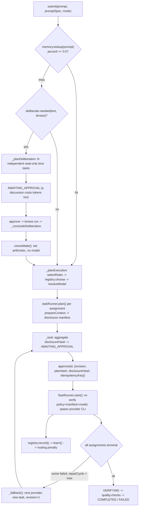

# BigKiji Universe — Architecture Reference

Derived by reading the source at `app/` (package version 2.5.0, `package.json`). Every claim
below cites the file it came from. Paths are relative to `app/`.

---

## 1. Process topology

Three long-lived process families, plus short-lived provider CLIs.

| Process | Entry | Lifetime | Owns |
|---|---|---|---|
| Electron main | `src/core/main.js` (`package.json` `"main"`) | menu-bar resident | tray, windows, PTY, TTS, IPC, in-app fallback orchestrator |
| Renderers | `src/components/UI/*.html` | per window | Three.js canvas, xterm terminal, audio, settings |
| Standalone daemon | `src/domain/server/daemon.js` | detached, survives app restarts | sessions, ideas, runs, mobile PWA, HTTP/SSE/WS on 8777 |
| Provider CLIs | spawned by `TaskRunner.start()` in `src/domain/pi-agent/task-runner.js` | one task, never resident | the actual paid work |

### Electron main

`app.whenReady()` in `src/core/main.js` builds the tray (`createTray()`, `new Tray(nativeImage.createEmpty())`
with `tray.setTitle('❖')`), the tray window, and — only under `SMOKE`/`SNAP`/`--show-main` — the main
window. On macOS it calls `app.dock.hide()` (`src/core/main.js:1392`) unless one of those flags is set, so
the normal state is menu-bar-only. `app.on('window-all-closed')` deliberately does nothing, and both
windows' `close` handlers `preventDefault()` and hide instead (`createTrayWindow`, `createMainWindow`).
A single-instance lock (`app.requestSingleInstanceLock()`) makes a second `npm start` just toggle the tray
window.

The main process also spawns a login shell through `node-pty` (`spawnShell()`), degrading to a plain
`child_process.spawn` pipe if `node-pty` fails to load; the mode (`'pty' | 'pipe'`) is reported in the
SMOKE line and in `get-info`.

### Windows

| File | Window | Notes |
|---|---|---|
| `src/components/UI/tray.html` | tray popover | 350×680, `frame:false`, `transparent:true`, `alwaysOnTop`, `backgroundThrottling:false`; draws its own tray icon and sends it back via `tray:render` |
| `src/components/UI/main.html` | Synapse Canvas | 1280×840, `titleBarStyle:'hiddenInset'` |
| `src/components/UI/setup.html` | first-run wizard | 780×600, `resizable:false`, deliberately opaque — the comment at `createSetupWindow()` says this avoids the `backdrop-filter`-vs-vibrancy conflict |
| `src/components/UI/remote/mobile.html` | phone PWA | **not** an Electron window; served by the daemon at `/` (`staticFiles` in `startDaemon`) |

All windows use the same preload with `contextIsolation: true, nodeIntegration: false`.

### contextBridge surface

`src/core/preload.js` exposes exactly one global, `window.bigkiji`, with ~110 members and no raw
`ipcRenderer`. Shape (all names from `src/core/preload.js`):

| Group | Examples |
|---|---|
| Bus / PTY | `onBusEvent`, `onPtyData`, `ptyInput`, `ptyResize` |
| Vault view | `onVaultFiles`, `onVaultTouch`, `onDeliverables`, `fileDetail`, `reveal` |
| Voice | `liveToggle`, `liveUtterance`, `onTtsChunk`, `voiceInterrupt`, `ttsStatus`, `ttsPreview` |
| Orchestration | `planTask`, `prepareTasks`, `approveTask`, `listRuns`, `approveRun`, `abortRun`, `onRunEvent` |
| Conversation / ideas | `conversationTurn`, `listIdeas`, `enhanceIdea`, `planIdea`, `promoteIdea` |
| Setup / tools | `setupState`, `setupPlan`, `setupApply`, `toolsDetect`, `toolsProbe` |
| Misc | `remoteAccess`, `previewStart`, `comfyGenerate`, `buildTaskReport`, `openExternal` |

`openExternal` is the only outward-facing call and it hard-rejects anything not `http(s)`
(`ipcMain.handle('open:external', …)` in `src/core/main.js`). `reveal` and `file:detail` both refuse paths
outside the vault (`isInside(VAULT, p)`, and the `absolute.startsWith(root)` check in `file:detail`).

### The daemon, and why it exists

`src/domain/server/daemon.js` is a plain-Node HTTP server bound to `127.0.0.1:8777` (`loadConfig()`).
`DaemonClient.ensure()` (`src/domain/server/daemon-client.js`) probes `/health`, and if nothing answers,
spawns `src/domain/server/daemon.js` with `detached: true, stdio: 'ignore'` and
`ELECTRON_RUN_AS_NODE=1` (see `daemonSpawnEnv`) so it runs headless rather than as a second Electron app.

It exists because state that must outlive the UI lives there:

* **Sessions** — append-only JSONL under `sessionsRoot` (`SessionStore`, asserted in `tools/daemon-selftest.js`).
* **Idea drafts** — `IdeaDraftStore`, hash-guarded (`STALE_IDEA_DRAFT`).
* **Runs** — the daemon owns its own `CoreExecutionCoordinator` and `TaskRunner` (`maxParallel: 3`).
* **The phone.** `staticFiles` serves the PWA, `manifest.webmanifest`, `sw.js`, icons and a vendored
  `three.module.js`; `/api/voice` accepts a 16 kHz mono WAV body and runs the same two-pass Whisper
  pipeline as the desktop (`src/domain/server/speech-to-text.js`).

The Electron app is a **client** of it when connected: `piSendPrompt`, `task:list`, `run:list`,
`session:*`, `idea:*` and `pi:abort` in `src/core/main.js` all branch on `daemonClient?.connected` and fall
back to the in-process `taskRunner`/`coordinator` otherwise. Daemon SSE/WS events are re-broadcast onto
the same renderer IPC channels through `channelMap` in `app.whenReady()`.

Port 8777 belongs exclusively to the daemon — main.js says so explicitly and never opens a second listener
(comment at `src/core/main.js:1431`).

### Where state lives

| State | Home |
|---|---|
| Sessions, ideas, runs, security counters | daemon process + `sessionsRoot`/`ideasRoot` on disk |
| Provider secrets | `SettingsStore` (Electron `safeStorage`), pushed to the daemon via `/api/security/credentials`; the daemon holds them in an in-memory `Map` only |
| Routing/quality/audio preferences | `<userData>/settings.json` (`src/core/settings-store.js`) |
| Routing lessons, capability priors | `model_capabilities.json` / `model_performance.json` under `knowledgeRoot` |
| Deliberated plans | `deliberation_memory.json` under `knowledgeRoot` |
| Transient UI state (canvas, terminal, audio) | renderer only |

---

## 2. Data root resolution

`src/core/data-root.js` is the single source of truth and is deliberately pure Node — the header comment
forbids `require('electron')` because the Electron main process, the daemon and the CLI all load it.

**Resolution order** (`resolveDataRoot()`):

1. `env.BIGKIJI_DATA_ROOT` → `source: 'env'`. This is also how `main.js` tells its children: it sets
   `process.env.BIGKIJI_DATA_ROOT = PATHS.dataRoot` before any other require (`src/core/main.js:19`), and
   `daemonSpawnEnv()` forwards it.
2. `<userData>/data-root.json` → `source: 'pointer'`, written by the setup wizard (`writePointer`).
3. `~/BigKijiUniverse` → `source: 'default'` (`defaultDataRoot()`).

`writeJsonAtomic()` writes a temp file, `fsync`s it, then renames — a truncated pointer would lose track of
the owner's data entirely.

**Layout** (`dataLayout(dataRoot, overrides)`):

```
<dataRoot>/
  bigkiji-data.json         ROOT_MARKER
  state/                    system_memory.json · remote.json · daemon.pid
                            mobile-devices.json · cli-config.json
  sessions/  ideas/  logs/  reports/  knowledge/  recordings/
  generated-media/  cache/tts/  models/  migrations/
```

`overrides` (per-key absolute paths) is what makes **reference mode** work: nothing moves, and each root
keeps resolving to where the data already is. `stateAt()` exists because the legacy CLI config is named
`config.json`, not `cli-config.json`, so a `stateRoot` override alone is not sufficient.

`src/core/path-config.js` layers app paths on top (`uiRoot`, `vaultRoot`, `graphPath`, tool binaries) and
spreads `layout` *first* so its own explicit keys win. `detectVault()` no longer hardcodes a personal path:
it uses `findVaultCandidates()`, which treats any directory containing `.obsidian/` as a candidate.
`whisperModel` and `ttsVenvPython` are resolved by probing both the new home and legacy `~/.bigkiji`, so a
465 MB model and a 1.4 GB venv keep working with zero movement.

First-run detection is `setup-state.json`, **not** "does dataRoot exist" — a half-failed migration would
otherwise strand the owner outside the wizard (`setupStatus()`). `SMOKE`/`SNAP`/`BIGKIJI_SKIP_SETUP=1`
return `kind: 'suppressed'`, and `main.js` only calls `ensureLayout()` when setup is `'done'` or the root
came from env/pointer — so a smoke run never leaves a stray `~/BigKijiUniverse` behind.

### Migration

`src/core/migration-plan.js` is a **pure planner** (stat only, zero side effects) so the wizard preview and
the actual run can never disagree. It is a whitelist, not "move `~/.bigkiji`", because that directory also
holds the owner's unrelated shell automation.

`src/core/data-migrator.js` executes it. Transactional model, from its header comment:

* Manifest written **before** any mutation (`manifestFile()`, `save()` after every state change).
* Same volume → `fs.rename` (atomic per entry).
* Cross volume → `EXDEV`/`EPERM`/`ENOTEMPTY` falls through to `mergeCopy` → `verifyCopy` → `digestFile` →
  `removeCopiedSources`. Resumable rather than atomic.
* Source deleted **strictly last**, which is what keeps `rollbackMigration()` always possible.
* Pointer and `settings.paths.*` written last of all (`ipcMain.handle('setup:apply')`), so a crash at any
  point leaves the app reading the legacy locations.

**What the migrator refuses to move, and why:**

| Refusal | Where | Reason given in code |
|---|---|---|
| dataRoot inside the Obsidian vault | `preflight()` | the app scans the vault and would index its own state |
| src/dst overlap | `preflight()` | corrupts the copy |
| < 1.2× total bytes free | `preflight()` | copy path needs both to coexist |
| `~/.pi/agent/knowledge/bigkiji-universe` | `copyOnly: true` in `entryTable()` | `~/.pi` belongs to the `pi` CLI; merged as a copy, original left in place |
| TTS venv (default OFF) | `group: 'models'` + `warning` | a virtualenv bakes absolute paths into `pyvenv.cfg`, `bin/python` and every shebang; moving it breaks TTS silently |
| Files the merge skipped (destination newer) | `mergeCopy` / `removeCopiedSources` | their contents were never carried across; deleting them would discard the owner's older revision and make rollback inexact |

Hashing is `sha256` below 32 MB and a head/middle/tail **sampled** digest above it — and the manifest says
`algo: 'sampled'` so it is not mistaken for a full hash (`digestFile()`).

`stopDaemonForMigration()` in `src/core/main.js` quiesces the daemon first (POST `/api/shutdown`, poll
`/health` 16×, SIGTERM the PID file at attempt 12): macOS has no mandatory locks, so the hazard is not the
rename but a write landing in the old location afterwards.

---

## 3. Workspace registry

`src/core/workspace-registry.js`. The model, in its own words, follows what Obsidian / VS Code / Zed /
Docker Desktop actually do:

* **Flat, explicit registration.** `candidates()` only *proposes*; `register()` is the only thing that
  writes. `tools/workspace-registry-selftest.js` pins this ("proposing a candidate must not register it").
* **Registry lives in the app's data directory** (`<userData>/workspaces.json`), never inside the folders
  it points at, so it survives one being deleted or unmounted.
* **Overlap is refused**, not silently double-counted — `register()` throws `Overlaps an existing
  workspace` for both nesting directions. Re-registering the same path is treated as an update.
* **Per-root excludes from the start** (`DEFAULT_EXCLUDE`: `node_modules`, `.git`, `.next`, `dist`,
  `build`, `graphify-out`, `_archive`, `recordings`, `venv`, `.venv`, `__pycache__`, `Pods`). Setting
  `exclude` explicitly **replaces** the defaults (asserted in the selftest).
* **A vanished root is reported, never re-pointed.** `statusOf()` distinguishes `missing` (ENOENT) from
  `unreadable` (EPERM/EACCES — a re-grant problem, not a re-pick problem).
* **`allows(target)` is the single gate.** Everything that scans or edits is meant to ask this rather than
  reason about paths itself.
* **Env override**: `BIGKIJI_WORKSPACES` (comma-separated) replaces the registry entirely so a test run
  cannot mutate the real one; `list()` marks those entries `overridden: true`.

See §8 — nothing in `src/` currently calls this.

---

## 4. Orchestration pipeline

Sources: `src/domain/pi-agent/core-execution-coordinator.js`, `task-runner.js`, `model-router.js`,
`model-capability-registry.js`, `deliberation.js`, `skill-registry.js`.



### Deliberation stage

`deliberation.js` defines three fixed `LENSES` — `architect`/`qwen`, `risk`/`glm`, `operator`/`codex` —
with the local free lens first so a discussion still happens when nothing paid is available. `needed()`
requires ≥ 2 lenses ("one lens is not a discussion, it is a delay"), and fires either on a `LOCAL_TOOLS`
match (n8n, ComfyUI, Blender, Unreal, ACE-Step, LTX, …) or on text ≥ 120 chars matching `SUBSTANTIAL`.

The merge is **code, not a model**: `consolidate()` extracts numbered/bulleted lines (`extractSteps`) and
keeps a step only if its keyword Jaccard against every accepted step is ≤ 0.4. Deterministic, free, and it
cannot hallucinate a step nobody proposed. `DeliberationMemory` recalls a plan at similarity ≥ 0.5 and
skips the discussion entirely. If the lenses produce nothing usable, `_concludeDeliberation()` proceeds
without a plan and records a note rather than stranding the run.

### Role selection

`selectRoles()` always includes `leader`; adds `ui` on UI/3D/design keywords, `debug` on debug/test/build
keywords, `context` above 12 000 chars, `facilitator` on research/requirements keywords when
`facilitationComplete !== true`, and `debug` again whenever `qualityGate === 'strict'` (the default).
`ROLE_BLUEPRINT` order — facilitator, leader, ui, debug, context — is then `.slice(0, run.maxAgents)`
(default 3, `settings.routing.maxAgents`).

| Role | Agent | Default provider | Writes |
|---|---|---|---|
| facilitator | Facilitator-Pi | gemini | no |
| leader | Lead-Pi | claude-code | yes |
| ui | Design-Pi | codex | yes |
| debug | Debug-Pi | glm | no |
| context | Context-Pi | qwen | no |

### Provider selection, then model tier

Order matters and is commented as such: `registry.choose(role, [preferred, ...FALLBACKS[preferred]])`
picks the **provider**, then `resolveModel(provider, text, role)` picks the **tier**. Doing it this way
means a fallback to GLM cannot carry a Claude model id with it.

`ModelCapabilityRegistry.score()` = `prior*0.55 + successRate*0.3 + latencyTerm*0.15 − penalty`, falling
back to `prior − penalty` when there are no samples. Observations are keyed per `provider::model`
("claude-code was slow" is a fact about the tier that ran, not about Claude Code); priors stay per
provider.

`model-router.js` wires exactly two Claude tiers and no more:

| Tier | Default id | Chosen when |
|---|---|---|
| `design` | `claude-fable-5` | `role === 'ui'`, or `DESIGN_SIGNALS` (markdown/docs/design/UI/CSS/copy/文章…), or `COMPLEX_SIGNALS` (architect/refactor/redesign/再構築…), or text > 6000 chars |
| `general` | `claude-opus-5` | everything else |

`resolveModel()` returns `''` for every non-Claude provider — GLM pins its id in the adapter, local Ollama
has nothing to pin — which keeps the disclosure manifest honest rather than inventing an id
(`tools/security-selftest.js` asserts both branches).

### Routing-lesson feedback loop

On each terminal assignment, `_ingestTask()` calls `registry.record()` → `learn()`:

* slow (`durationMs > BIGKIJI_SLOW_TASK_MS`, default 180 000 ms) or failed → penalty `+0.06`
  (`+0.12` if both), capped at `0.45`
* fast success → penalty `−0.04`, floored at 0

The penalty is written into `model_capabilities.json` — the same file the priors live in — so the next
`choose()` routes around it, and it decays so one bad afternoon does not retire a provider. The lesson is
emitted as a `lesson` event and recorded in the knowledge log, because "a routing change the owner cannot
see is indistinguishable from the router being erratic". `_fallback()` resets `assignment.learned = false`
so the replacement provider is judged on its own result.

### Approval and repair

`_seal()` sets `AWAITING_APPROVAL` for **every** run regardless of `mode` — the comment states owner policy
is intentionally stronger than `executionMode`. `approve()` rejects `STALE_RUN_REVISION`,
`STALE_PLAN_HASH`, `STALE_DISCLOSURE_HASH`, and de-duplicates on `idempotencyKey`.

On failure, `_fallback()` walks `FALLBACKS[provider]` one step per repair cycle, builds a new task carrying
the previous error, bumps `revision`, recomputes `planHash` and `disclosureHash`, and returns the run to
`AWAITING_APPROVAL` — a repair is re-approved, not auto-run. `maxRepairCycles` defaults to 3
(`settings.quality.maxRepairCycles`).

Verification is two checks in `run.quality.checks`: all assignments completed, and at least one completed
read-only assignment existed (maker–checker separation).

### Skills

`SkillRegistry` (`skill-registry.js`) indexes SKILL.md files from the app's own `skills/`, `~/.claude/skills`,
`~/.claude/plugins/cache`, the vault, and tool repos one level under `~/Documents`. Matching is two-tier —
frontmatter description terms score heavily, body terms only corroborate — with CJK character bigrams
because whitespace tokenisation produces nothing useful for Japanese. Terms appearing in > 40 % of skills
are pruned (cheap IDF). `brief()` returns **text only**; the header comment is explicit that this never
grants filesystem access and the sandbox boundary is unchanged.

---

## 5. Security model

Files: `src/domain/pi-core/security/` (`security-policy.js`, `disclosure-manifest.js`,
`payload-redactor.js`, `tool-interceptor.js`, `research-broker.js`, `hook-entry.js`) plus
`src/domain/pi-agent/sandbox-policy.js`.

### Sandbox policy resolution

`SandboxPolicyResolver.resolve(cwd)` (`sandbox-policy.js`) walks up from `cwd` to `vaultRoot` looking for
`.pi/sandbox.json` or `sandbox.json` (`findSandbox`). Outside the vault → `valid: false`. Every
`allowRead`/`allowWrite` root is `realpath`-resolved, then filtered to `isInside(vaultRoot, …)` and
`!isSensitivePath(…)`, so a symlink cannot widen the sandbox (asserted in `tools/security-selftest.js`).
With no sandbox file the source is `'safe-default'` (read+write = taskRoot only). `SecurityPolicy.normalize()`
adds `webSearch: 'broker-only'`, `unknownTools: 'deny'`, a five-entry shell allowlist, and a sha256
`policyHash` over the whole object.

### Disclosure manifest

`createDisclosureManifest()` records, and hashes into `disclosureHash`:

| Field | What it buys |
|---|---|
| `files[].sha256` | the exact bytes of every context slice |
| `payloadHash` | the exact prompt text that will be sent |
| `policyHash` | the exact sandbox in force |
| `model` | the specific brain — "approving Opus reads these files" must not also authorise a different model |
| `externalTools[]` | the exact sanitised query that would leave the machine, by name |
| `redactions[]`, `estimatedTokens` | what was stripped, how big it is |

`verifyDisclosureManifest()` re-hashes all three at spawn time, and `TaskRunner.start()` additionally
re-checks `policyHash` and `disclosure.model === task.model`, throwing `STALE_SECURITY_POLICY`,
`STALE_DISCLOSURE_MANIFEST` or `STALE_MODEL_SELECTION`. `aggregateDisclosureHash()` folds the per-task
hashes into one run-level value that the UI/phone must echo back on approve.

What it buys: an approval is bound to a specific (files, prompt, policy, model, external queries) tuple.
Edit a file between preview and approval and the launch is refused, not silently re-approved.

### Payload redaction

`payload-redactor.js` has 13 ordered patterns; vendor-specific ones run **before** the generic `sk-` one so
a finding is labelled with the provider it belongs to (a mislabelled key sends the owner to the wrong
console to rotate it). Private keys are `critical: true` → `blocked`, which aborts the task rather than
redacting. `redactPayload` runs on: owner prompts and directives (`daemon.js` `turn`/`prompt`/`directive`),
pruned context (`context-pruner.js`, throws `SECURITY_CRITICAL_SECRET_IN_CONTEXT`), and every line of
provider stdout/stderr (`TaskRunner.append` — a critical hit kills the child).

`sanitizeSearchQuery()` additionally strips code fences, replaces any path with `<PATH>`, and blocks the
query if > 4 code signals survive or a `<PATH>` remains.

### Tool interceptor

`ToolInterceptor.decide(event, policy)` is a default-deny gate: unknown tool → deny; any web/browser tool
or `mcp__*` → deny; reads/writes must pass `assertPath` against the policy roots; shell must be free of
`| ; & > < \` $()`, free of network/dynamic-code binaries, and match the policy's five-entry allowlist. It
runs as a Claude `PreToolUse` hook via `hook-entry.js`, which is wired in by
`TaskRunner.writeProviderPolicies()` into a per-task `claude-settings.json`.

### Research broker

`ResearchBroker` is "the only sanctioned way anything reaches the network". Providers have web tools denied
outright, so a specialist requests a fact instead of fetching it; `prepare()` sanitises the query and
`prepareAll()` fails the **whole task** on one blocked query — running the specialist without the fact it
said it needed produces a plausible but uninformed answer. Note the broker only *records* the approved
query in the manifest; there is no fetch implementation in this tree (see §8).

### Minimal env and per-task runtime

`SecurityPolicy.createRuntime(taskId)` `mkdtemp`s under `os.tmpdir()/bigkiji-secure-runtime/`, with `home/`
and `tmp/` at `0700` and a `security-policy.json` at `0600`. `writeProviderPolicies()` then writes, per
provider: Claude settings + empty `mcp.json`; Gemini admin-policy TOML, `trustedFolders.json` and a
`.gemini/settings.json` inside the fake HOME.

`minimalEnv()` builds the child environment from scratch — `PATH`, locale, `TERM`, `HOME`/`TMPDIR`/`XDG_*`
pointed at the runtime dir, `BIGKIJI_EXECUTOR`, `BIGKIJI_SECURITY_POLICY`, `PI_TELEMETRY=0`, `NO_COLOR=1`,
plus exactly one provider secret from `PROVIDER_SECRET`. `tools/security-selftest.js` plants
`BIGKIJI_CANARY_SECRET` in the parent and asserts it never reaches the child.

`cleanupRuntime()` `rm -rf`s the runtime directory in `finish()` and on every blocked start, so the policy
file, fake HOME and provider config exist only for the life of one task.

Adapter flags reinforce the same posture: Claude gets `--strict-mcp-config --disallowed-tools
WebSearch,WebFetch,mcp__.*` and `--permission-mode plan` when there is no write root; Codex gets
`--ephemeral --ignore-user-config --strict-config -c web_search="disabled" -c
shell_environment_policy.inherit="none"`; GLM runs through `pi --no-tools --no-extensions --no-skills`.

### What this model does NOT protect against

* **It is not an OS sandbox.** The child is an ordinary `child_process.spawn` with the real filesystem
  visible. `allowRead`/`allowWrite` are enforced by policy files and, for Claude, by a hook — a provider
  that ignores its own hook/permission contract is not stopped by anything here.
* **Only Claude gets `ToolInterceptor`.** `hook-entry.js` is wired into the Claude settings file only.
  Codex, Gemini and GLM rely on their own vendor flags; local `qwen`/`ollama` bypass `assertProvider`
  entirely (`TaskRunner.start()`) and run `ollama run <model> <prompt>` with no interception at all.
* **Redaction is pattern-based.** A secret in an unrecognised format passes through; `SENSITIVE_FILE` /
  `SENSITIVE_SEGMENT` are regex lists, not a classifier.
* **Sampled digests.** Files over 32 MB are verified by head/middle/tail + size, not fully.
* **`/api/shutdown` and the token.** The daemon token sits in `remote.json` at mode `0600`; any local
  process running as the owner can read it and drive the full API.
* **No transport encryption locally.** The daemon binds `127.0.0.1` in the clear; remote exposure is
  delegated wholesale to Tailscale Serve (`src/core/tailscale-remote-access.js`).
* **The vault itself is not protected from the owner's own shell** — the PTY in `main.js` is an
  unrestricted login shell, entirely outside this policy.

---

## 6. Rendering / UI layer

**Three.js synapse canvas.** `src/domain/3d-canvas/components/synapse.js` (~2 460 lines) is loaded as a
plain ES module by `main.html`, resolved through an import map pointing at
`node_modules/three/build/three.module.js`. It is one scene rendering the whole organisation: a "file
galaxy" built from the real `vault:files` IPC payload (`buildFileGalaxy`, `buildCloud`, radial folder
colonies), a 30 000-point GPU stardust swarm with inline GLSL (`STARDUST_VERT`/`FRAG`), a 260-fibre
Core⇄node synapse bundle (`buildFiberBundle`), per-department particle clusters, orbiting planets and
moons, and a 7-phase core awakening sequence (`SEQ`, `triggerCoreAwakening`, `updateCoreAwakening`,
`beginCoreFinale`). Everything animated is driven by real events — `handleEvt`, `exciteStream`,
`emitBurst`, `flashFile` — plus HUD overlays (COMMS cards, turn-flow cards, live commentary crawl, vitals)
that read the same IPC streams. A `RENDER_PRIORITIES` LOD switch (`auto | performance | graphics`) comes
from `settings.appearance`.

**Terminal.** `main.html` instantiates `@xterm/xterm` with `FitAddon` (both loaded as UMD from
`node_modules`), wires `term.onData` into `CmuxTerminalMirror` (`src/domain/terminal/components/`), and
falls back to `window.bigkiji.ptyInput` when cmux is not connected. `MultiTerminalManager` owns the tab
strip (NEURAL dashboard / MISSION RELAY / SESSIONS / pinned BIGKIJI SESSION / per-task streams / PREVIEW)
and receives `onTaskEvent`, `onTaskLog`, `onRunEvent`, `onCommentary`, `onBusEvent`. `TerminalResizer`
handles the drag handle and re-fits. The PREVIEW tab is an `<iframe sandbox="allow-scripts
allow-pointer-lock">` pointed at `PreviewServer` (`src/core/preview-server.js`, ports 4317–4399, SSE live
reload).

**Audio engine + audio-reactive background.** `src/components/UI/audio-engine.js` installs
`window.BKAudio`: two playback buses (`ownerGain`, `agentGain`) and three SFX buses (`ui`, `alert`,
`ambient`) all routed through a single `AnalyserNode` (`fftSize 512`), so a visualiser can read the
spectrum from one place. The `AudioContext` is created lazily on first sound, so `BKAudio.analyser` is
`null` until `ensure()`. `connectVoice()` applies a deliberate telephony chain (300 Hz HP → 3400 Hz LP →
2.8 kHz peak → compressor). TTS chunks arrive over IPC (`voice:tts-chunk`) and are queued per track;
playback state is reported back to main via `voice:playback-state`, which is how the voice SLA timers in
`main.js` are satisfied. SFX cues also emit a `bk-sfx-cue` DOM event carrying the cue id, because at
fftSize 512 the ~86 Hz bins cannot resolve the cue pitches — the comment says so explicitly.
`mountAudioWaveField()` (`src/domain/3d-canvas/components/audio-wave-field.js`) mounts the background wave
behind the canvas and stops its own rAF loop while silent.

**CLI TUI renderer.** `src/cli/tui/renderer.js` exports `TUIRenderer` (full-screen `bigkiji monitor`) and
`StickyScreen` (REPL). No curses and no dependencies — DECSTBM (`ESC[top;bottom r`) plus absolute cursor
addressing only, with a sticky header, a scrolling relay region and a sticky footer. There is no box
drawing anywhere; hierarchy comes from the gutter and indentation so the layout survives a 60-column
terminal. Widths are measured with `stringWidth`/`truncateToWidth` from `transcript.js` because
`String#length` overflowed every Japanese line by up to 2×. Real progress from the daemon always wins over
`keywordProgress()`, and `PHASE_STEMS` uses shared prefixes (`EXECUT`) after a substring bug meant
`'EXECUTING'.includes('EXECUTE')` was false and the EXECUTE step never lit. `TUIMonitor`
(`src/cli/tui/monitor.js`) drives it from `DaemonClient` events with `q/r/a/x/h/Shift+Tab` keys; the
entry point is `tools/bigkiji` → `tools/bigkiji-cli.js` → `src/domain/terminal/bigkiji-cli.js`.

---

## 7. Testing

Structure: one standalone Node script per concern under `tools/`, each named `*-selftest.js`, each using
only `node:assert` — there is no test framework or runner dependency. `npm test` chains 28 of them with
`&&`, starting with `check:imports` and `test:architecture`.

| Kind | Examples |
|---|---|
| Structural | `import-selftest.js` (walks `src/` + `tools/` and fails on any broken relative import), `architecture-selftest.js` (required files exist, forbidden legacy paths do not, `package.json` invariants, `main.html` script paths) |
| Pure-logic | `routing-learning-selftest.js`, `deliberation-selftest.js`, `cost-policy-selftest.js`, `cli-render-selftest.js`, `cli-theme-selftest.js` |
| Injected-dependency integration | `security-selftest.js` and `deliberation-selftest.js` build a real `TaskRunner` with `spawnImpl` replaced by a fake child; `daemon-selftest.js` starts a real `DaemonEngine` on port 0 in a temp `stateRoot` |
| Filesystem | `workspace-registry-selftest.js`, `context-routing-selftest.js`, `skill-registry-selftest.js` — all `mkdtemp` + `rm -rf` |
| Live, not in `npm test` | `tools/selftest.js` actually shells out to `pi` against the real vault and writes `tools/selftest-result-<date>.json` |

**`SMOKE=1`** is not part of `npm test`; it is the Electron boot check
(`SMOKE=1 npx electron .`, and `xvfb-run -a env SMOKE=1 ./node_modules/.bin/electron .` in
`.github/workflows/ci.yml`). In `src/core/main.js` it: suppresses the setup wizard, skips the daemon
handshake entirely (`if (!SMOKE)` at line 1311), keeps the dock icon, force-shows both windows, seeds
`trayLoaded`/`mainLoaded` from current WebContents state so a fast machine cannot lose the race, collects
`did-fail-load` and console errors at level ≥ 3, then after 4 s prints
`SMOKE OK|FAIL tray=… trayWin=… mainWin=… pty=… rendererErrors=…` and exits with that status. `SNAP=<dir>`
is the sibling screenshot mode; `PITEST`/`TTSTEST`/`VOICETEST`/`BIGKIJI_E2E_FIXTURE` are further one-shot
harnesses in the same file.

**Adding a new selftest:**

1. Create `tools/<name>-selftest.js`, `'use strict'`, `require('assert')`, no new dependency.
2. Use a `mkdtemp` root and clean it up; inject `spawnImpl`/`stateRoot`/`env` rather than touching real
   state (the workspace selftest asserts explicitly that an env override does not write the real registry).
3. End with a one-line `console.log('<name> selftest: PASS · <what was proven>')` and
   `process.exitCode = 1` on failure.
4. Add `"test:<name>": "node tools/<name>-selftest.js"` to `package.json` scripts **and** insert it into
   the `test` chain — a script that is not in the chain never runs in CI.
5. If it asserts a new required file, add that path to the `required` list in
   `tools/architecture-selftest.js`.

---

## 8. Open questions / suspected dead code

1. **`src/core/workspace-registry.js` is not wired in.** `grep` over `src/` finds no consumer: `main.js`
   still resolves a single `PATHS.vaultRoot` through `detectVault()`, and the daemon uses
   `BIGKIJI_WORKSPACE || process.cwd()`. `allows()` is documented as "the single gate" but nothing calls
   it. Only `tools/workspace-registry-selftest.js` and the file list in `tools/architecture-selftest.js`
   reference the module. Either it is staged for a future release or the integration was lost.

2. **`findPendingManifest()` (`src/core/data-migrator.js:267`) is exported but never called.** Its comment
   says "a pending manifest at launch means the previous run died mid-flight", but no launch path checks
   for one, so an interrupted migration is never detected or offered for rollback.

3. **Likely bug — `daemon.js:148`.** The inventory timer's catch handler calls `engine.publish(...)` from
   inside the `DaemonEngine` constructor. `engine` is a parameter of `startDaemon()`, not visible in class
   scope, so a failing `refreshInventory()` throws `ReferenceError` inside a timer instead of publishing
   the error. Should be `this.publish(...)`.

4. **Likely bug — `daemon-client.js:128`.** The WebSocket `close` handler does
   `this.connect().catch(…)`, but `connect()` returns `undefined`, so this throws `TypeError` in a
   `setTimeout` (unhandled in the Electron main process). It is also a no-op by construction:
   `connect()` returns early while `this.controller` is still set, which it is on an unsolicited close.
   Net effect: **the daemon event stream never auto-reconnects.**

5. **The research broker has no fetch path.** `ResearchBroker` only sanitises and records queries into the
   manifest; nothing in this tree performs the approved search, and no code populates
   `task.metadata.research` outside `tools/security-selftest.js`. So the "brokered external tool" lane is
   currently declaration-only.

6. **`maxAgents` can silently drop the strict-mode checker.** `ROLE_BLUEPRINT.filter(...).slice(0,
   maxAgents)` in `_planExecution()` slices in blueprint order (facilitator, leader, ui, debug, context).
   With the default `maxAgents: 3` and a prompt that selects facilitator+leader+ui+debug, `debug` — added
   unconditionally by `qualityGate: 'strict'` — is the one cut. Intentional priority or an ordering
   oversight is not stated.

7. **Provider availability is never consulted when choosing.** `ModelCapabilityRegistry.choose()` scores on
   priors/performance only. A provider with no configured secret is still selectable; the failure surfaces
   later as a spawn failure and a repair cycle. `fastRouter.detect()` (`fast-api-router.js`) does return
   availability, but it hardcodes every paid provider to `false` and is only used for HUD display.

8. **Two `bigkiji-cli` files.** `tools/bigkiji-cli.js` is a 7-line shim into
   `src/domain/terminal/bigkiji-cli.js`. Not dead, but the duplicate name is easy to misread.

9. **`app/src/domain/i18n/` is an empty directory tree** next to the real `src/`. It contains no files;
   it appears to be a leftover of a move.

10. **`src/components/UI/assets/` holds three `accretion.png` backups** (`.bak-20260802-1024`,
    `.bak-v10`, plus `accretion-sm.png`). `package.json` `build.files` is `**/*` minus `.env`,
    `recordings/` and `graphify-out/`, so these ship in the installer.

11. **Doc/reality drift in the task brief itself:** there is no `src/core/daemon-client.js`
    (it is `src/domain/server/daemon-client.js`) and no `src/components/UI/js/synapse.js`
    (it is `src/domain/3d-canvas/components/synapse.js`). `tools/architecture-selftest.js` pins the real
    paths.

12. **`TaskRunner.approve()` accepts a `failed` task** (`task.status !== 'awaiting_approval' && !== 'failed'`)
    while still requiring the *original* `disclosureHash`. Since `prepareContext()` is not re-run on that
    path, the manifest verification in `start()` will reject it whenever the files or policy have moved on.
    Whether re-approving a failed task without `retry()` is meant to work is unclear.
