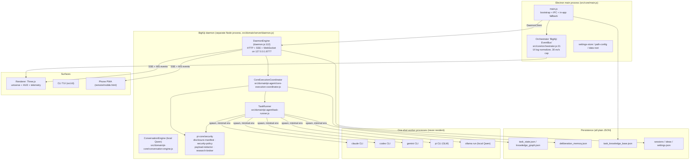
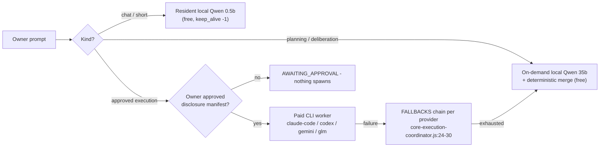
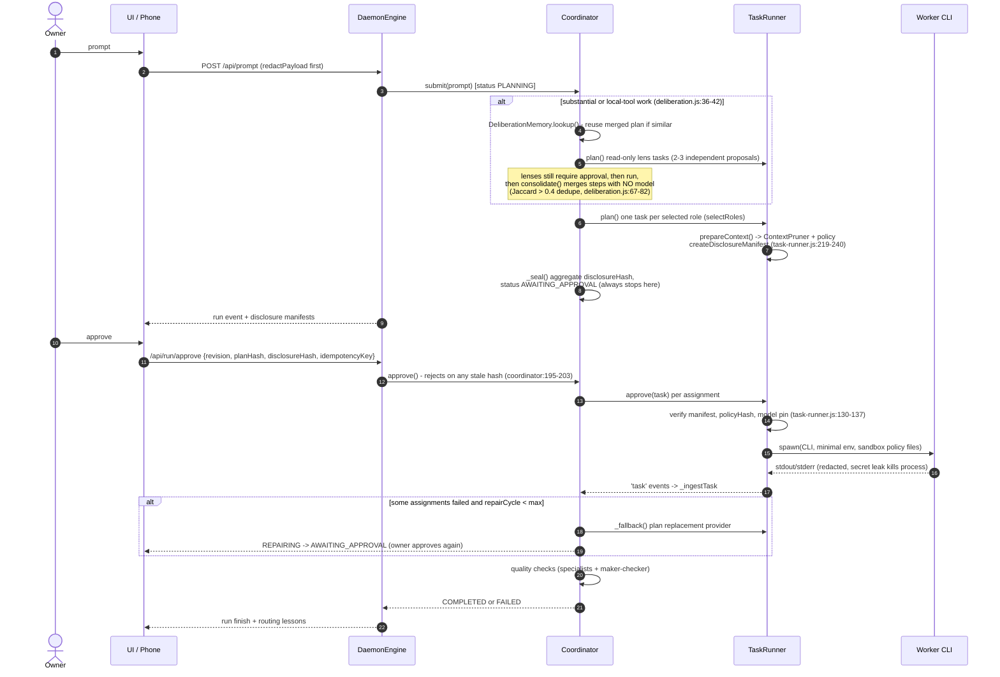
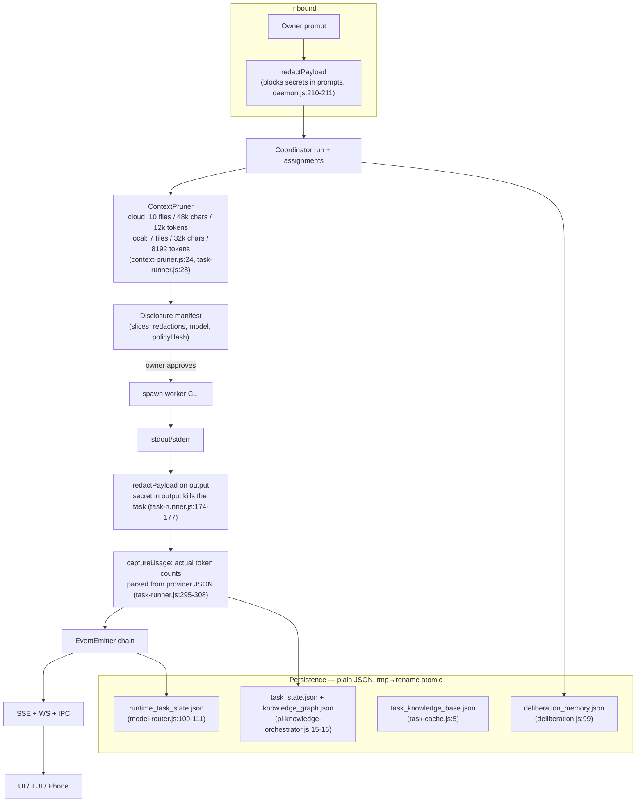

# BigKiji Universe V3 — Architecture Overview

Status: DESIGN SPECIFICATION (V3). Baseline analyzed: V2.5 (`package.json` version 2.5.0).

Measurement discipline: this document follows constitution rule 25
(`src/domain/pi-core/system-instructions.md:31`) — *"State a number only if it was
measured. Say 'not measured' otherwise."* Every performance figure below is either a
code constant (cited with file:line) or an explicit **target** with an actuals column
that reads `not measured`.

---

## 1. What BigKiji Universe is

An Electron menu-bar app that lets a single owner run a fleet of external AI CLI tools
(Claude Code, Codex, Gemini, GLM via `pi`, local Ollama/Qwen) as **sealed, one-shot,
approval-gated worker processes**, visualized as a 3D universe. There is no cloud
backend: everything runs on the owner's machine, persistence is plain JSON, and paid
model spend is impossible without an explicit owner approval of a disclosure manifest.

Runtime facts (verified in `package.json`):

| Item | Value | Source |
|---|---|---|
| Shell | Electron ^43.2.0 | `package.json:132` |
| Node | >=24 <27 | `package.json:16` |
| 3D | three ^0.172.0 | `package.json:127` |
| Runtime npm deps | 8 (`@xterm/xterm`, `@xterm/addon-fit`, `dotenv`, `dotenv-expand`, `node-pty`, `qrcode`, `three`, `ws`) | `package.json:120-129` |
| DB / vector store / LLM SDK | none — persistence is raw JSON with tmp→rename atomic writes | `src/domain/pi-agent/pi-knowledge-orchestrator.js:38-43` |

**V3 constraint (owner policy): the npm dependency count does not grow.** No SQLite, no
LMDB, no vector DB, no LLM SDKs. Anything V3 adds must be pure Node + existing deps.

---

## 2. Component map (V2.5, verified)

Key structural facts, each verified:

- **Two-layer execution, no recursion.** A *run* (parent) fans out into *assignments*,
  each backed by exactly one spawned CLI process. Children cannot spawn agents: the
  Claude adapter denies `mcp__.*`/web and pins six tools
  (`src/domain/pi-agent/task-runner.js:246,278`), the Gemini admin policy denies
  `invoke_agent`/`activate_skill`/shell (`task-runner.js:256-259`), Codex runs
  `--ephemeral --strict-config` sandboxed (`task-runner.js:281-284`), GLM runs
  `--no-tools --no-extensions` (`task-runner.js:288-289`).
- **The "EventBus" is not an agent bus.** `src/core/orchestrator.js:2` calls itself the
  "BigKiji EventBus", but it is a UI-facing log normalizer: it parses pty output,
  rate-limits to 30 events/s (`orchestrator.js:27,33-39`), and emits a 5-second
  SystemPulse of real OS metrics (`orchestrator.js:83-100`). Agent coordination flows
  through a direct EventEmitter chain instead: `TaskRunner → Coordinator`
  (`core-execution-coordinator.js:74`) and `TaskRunner/Coordinator → DaemonEngine`
  (`daemon.js:150,168`), which fans out to SSE/WebSocket clients (`daemon.js:627-632`).
  The camelCase identifier `eventBus` appears nowhere in `src/` (grep: 0 hits); the
  word "EventBus" occurs only in two comments (`orchestrator.js:2`,
  `src/domain/3d-canvas/components/orb-core.js:3`).
- **The daemon is the security boundary for remote surfaces.** It pins
  `executionMode: 'plan'` regardless of saved settings so a phone can never reach an
  auto-approve path (`daemon.js:193-197`), and `/api/run/approve` re-checks revision,
  planHash and disclosureHash server-side (`daemon.js:600-605`).
- **The Electron app degrades gracefully.** If the daemon is unreachable, `main.js`
  falls back to its in-app TaskRunner/Coordinator pair (`src/core/main.js:64,935-943,
  1009-1015`).

---

## 3. Local First priority chain

The routing policy is *local by default, paid only after a sealed approval*. The chain
is enforced in three independent places, which V3 keeps:

1. **Conversation is resident-local.** The chat tier is `ollama/qwen2.5:0.5b` with
   `keep_alive: -1` (`src/domain/pi-agent/model-router.js:51`); the daemon pre-warms it
   at config time so the first turn does not fall into the deterministic fallback path
   (`daemon.js:326-340`, `model-router.js:143-162`).
2. **Planning and memory are local-only by construction.** The knowledge module
   "deliberately has no network client" (`pi-knowledge-orchestrator.js:3-4`), and the
   planning router refuses to even inspect paid credentials
   (`model-router.js:59-61`). Deliberation's first lens is local Qwen
   (`src/domain/pi-agent/deliberation.js:22-24`), so a discussion still happens when
   nothing paid is available.
3. **Paid spend requires a plan.** `canSpend(provider, planned)` throws unless the
   provider is whitelisted, and returns true for paid providers only when `planned` is
   set — which happens only on the approved execution path
   (`pi-knowledge-orchestrator.js:17-18,129-133`, checked at spawn in
   `task-runner.js:130`).

Notes on the chain:

- Confidential-flagged prompts route straight to local (`model-router.js:76-79`).
- Provider fallback on failure is data, not code: `FALLBACKS`
  (`core-execution-coordinator.js:24-30`) ends every chain in `qwen`/`glm`, i.e. the
  cheapest tier, and each replacement re-seals a fresh disclosure and waits for
  approval again (`core-execution-coordinator.js:297-303`).
- Model tier is part of the approval: re-tiering between approval and launch is a hard
  error `STALE_MODEL_SELECTION` (`task-runner.js:135-137`).

---

## 4. Run lifecycle — sequence diagram

Run statuses observed in code: `PLANNING → (deliberation | execution stage) →
AWAITING_APPROVAL → EXECUTING → [REPAIRING → AWAITING_APPROVAL]* → COMPLETED | FAILED`.
They are raw string literals in the coordinator; `src/core/types.js:3-12` has a
`FLEET_STATUS` enum but the coordinator does not import it (see `01-agent-mesh.md` §5a).

The single most important invariant: **nothing mutation-capable ever runs without
passing `AWAITING_APPROVAL`** (`core-execution-coordinator.js:190-191`), and approval
is rejected on stale revision, stale plan hash, or a missing/stale disclosure hash
(`core-execution-coordinator.js:198-200` — disclosureHash is mandatory, the others are
checked when supplied).

---

## 5. Data flow

Everything persisted goes through `cleanText`/`redactPayload` first, and the graph and
event stores are bounded ring buffers (nodes ≤500, edges ≤1000, events ≤300 —
`pi-knowledge-orchestrator.js:84,123,127`), so no store grows without limit.

---

## 6. V3 direction — what changes, what must not

V3 is a consolidation release, not a rewrite. The 2026 survey work (see
`01-agent-mesh.md` §4) concluded that the current shape — one orchestrator, sealed CLI
workers, owner-approved disclosure — is already the Orchestrator-Workers topology that
field evaluations rank as the best cost/benefit. Accordingly:

**Invariants V3 must preserve**

1. Approval gate before any mutation-capable or paid work (no bypass path, including
   from remote surfaces).
2. Two-layer topology; workers stay one-shot and cannot spawn agents.
3. Local-first chain; planning never touches the network.
4. Plain-JSON persistence with atomic writes; zero new npm dependencies.
5. Honesty rules: no invented health (`tool-registry.js:19-20`), no unmeasured numbers
   (constitution rule 25).

**Planned changes** (specified in the sibling documents)

| Change | Doc |
|---|---|
| Make `VERIFYING` an observable state; unify status constants | `01-agent-mesh.md` §5a |
| Merge the two parallel plan memories (task-cache vs DeliberationMemory) | `01-agent-mesh.md` §5b |
| Criteria-gated Critic pass for high-error-cost outputs only | `01-agent-mesh.md` §5c |
| Context engineering rules (raw recent, local summaries for old, never compress errors) | `01-agent-mesh.md` §5d |
| Plugin contract generalizing the tool registry | `11-plugins.md` |

**Targets** (all *targets*; nothing here has been benchmarked):

| Metric | Target | Actual |
|---|---|---|
| Context tokens sent to paid workers vs unpruned baseline | reduce (pruner already reports per-task `tokensSaved` from actual usage, `task-runner.js:303-306`) | not measured (no aggregated benchmark exists) |
| First observable event after approval | < 1 s target | not measured |
| Conversation first-token after warm-up | below the 8 s deterministic-fallback cutoff wired in `ConversationEngine` (`model-router.js:135-138` comment) | not measured |
| Repair cycles per failed run | ≤ configured `maxRepairCycles` (default 3, `core-execution-coordinator.js:91`; daemon pins 2, `daemon.js:197`) | not measured as a distribution |
