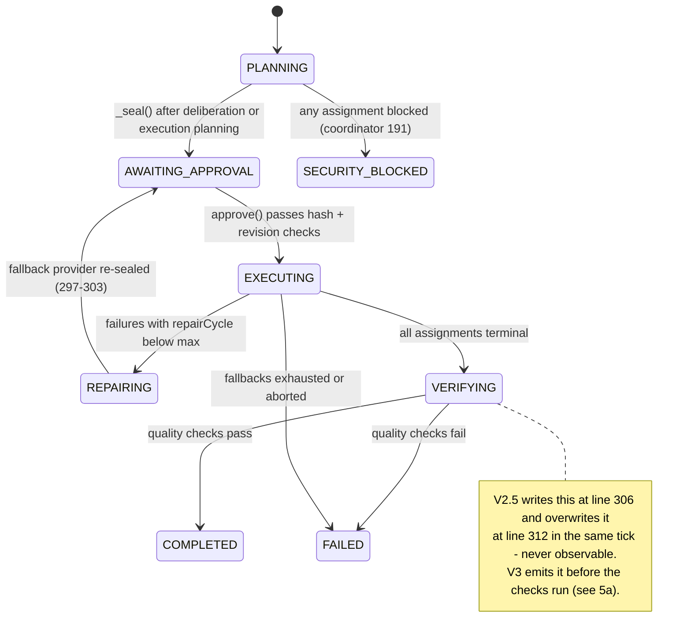

# V3 — Agent Topology: PiAgent vs Blackboard / Actor / HTN / Planner-Executor-Critic / Agent Mesh

Status: DESIGN SPECIFICATION (V3). Numbers follow constitution rule 25
(`src/domain/pi-core/system-instructions.md:31`): code constants are cited with
file:line; performance claims from external research are attributed; anything of ours
that was not benchmarked says `not measured`.

**Verdict up front: the current structure is correct.** BigKiji is already an
Orchestrator-Workers system with a hard human approval gate — the topology that 2026
production evaluations rank as the best cost/benefit (§4). V3 does **not** introduce a
blackboard, an actor framework, HTN, or agent-to-agent messaging. It makes four
targeted additions to what exists (§5) and explicitly rejects the rest (§6).

---

## 1. The current PiAgent structure (verified)

### 1.1 Topology: run → assignment → one real CLI process

- A **run** is the parent unit, owned by `CoreExecutionCoordinator`
  (`src/domain/pi-agent/core-execution-coordinator.js`). It selects 1–5 roles from a
  fixed blueprint — facilitator/gemini, leader/claude-code, ui/codex, debug/glm,
  context/qwen (`ROLE_BLUEPRINT`, coordinator :11-17) — by prompt heuristics
  (`selectRoles` :32-42), keeps them by importance under `maxAgents`
  (`ROLE_PRIORITY` :22, applied :150-152), and falls back per provider along a fixed
  chain (`FALLBACKS` :24-30, `_pick` :182-185).
- An **assignment** maps 1:1 to a `TaskRunner` task
  (`src/domain/pi-agent/task-runner.js`), which spawns exactly one external CLI
  process with a minimal env and per-task sandbox policy files (`start` :126-169,
  `adapter` :271-293).
- **There is no third layer.** Workers are stripped of agent-spawning ability:
  Claude gets `--allowed-tools Read,Edit,Write,Bash,Grep,Glob` and denies
  `mcp__.*`/web (:278, settings deny at :246-247); Gemini's admin policy denies
  `invoke_agent`, `activate_skill`, web and shell (:256-259); GLM runs `--no-tools
  --no-extensions --no-skills` (:288-289); Codex runs `--ephemeral --strict-config`
  sandboxed (:281-284).

### 1.2 State machine

`PLANNING → (deliberation | execution stage) → AWAITING_APPROVAL → EXECUTING →
[REPAIRING → AWAITING_APPROVAL]* → COMPLETED | FAILED`

- Statuses are **raw string literals** in the coordinator. An enum exists
  (`FLEET_STATUS`, `src/core/types.js:3-12`) but the coordinator does not import it;
  only `fleet-metrics-store.js` maps into it.
- `_seal()` aggregates every assignment's disclosure manifest into one
  `disclosureHash` and always stops at `AWAITING_APPROVAL` (coordinator :187-193).
- `approve()` rejects on stale revision, stale planHash, missing/stale disclosureHash
  (mandatory), and deduplicates by idempotencyKey (:195-203).
- **`VERIFYING` is unobservable.** It is written at :306 and synchronously overwritten
  with `COMPLETED`/`FAILED` at :312 in the same tick — no `_emit` happens in between,
  so no listener ever sees it. Three UI surfaces nevertheless carry it in their
  progress maps (`src/domain/telemetry/components/right-telemetry-panel.js:58`,
  `src/domain/terminal/components/multi-terminal-manager.js:171`,
  `src/components/UI/remote/mobile.html:359`) — dead entries today.

### 1.3 Deliberation: pre-work proposals, merged without a model

`src/domain/pi-agent/deliberation.js` runs 2–3 independent read-only lenses
(architect/qwen, risk/glm, operator/codex — `LENSES` :22-29), triggered for
substantial work or local-tool runs (`needed` :36-42). `consolidate()` is **set
arithmetic, not a model**: steps are deduplicated by keyword Jaccard > 0.4
(:67-82), so merging costs zero tokens and cannot hallucinate a step nobody proposed.
`DeliberationMemory` recalls a merged plan for similar prompts (threshold 0.5,
:97-138) so the same discussion is never paid for twice.

### 1.4 Feedback: repair, fallback, routing lessons

Failed assignments are retried on the next fallback provider with a fresh disclosure
and a fresh owner approval (`_fallback` :341-360, re-seal at :297-303). Only work that
actually ran teaches the capability registry — `blocked` is excluded so security
decisions do not poison routing scores (:265-286).

---

## 2. Pattern-by-pattern comparison

| Pattern | What it would give BigKiji | What it costs | Verdict |
|---|---|---|---|
| **Orchestrator-Workers** (status quo) | Central plan/approve/repair; workers isolated and cheap to reason about | Orchestrator is a single point of logic (acceptable: it is ~700 lines across two files and fully event-driven) | **Keep** |
| **Blackboard** | Opportunistic collaboration via shared workspace; workers react to partial results | A shared mutable store contradicts the sealed-disclosure model (a worker's inputs would no longer be what the owner approved); adds coordination state with no consumer | **Reject** |
| **Actor model (formal)** | Supervision trees, location transparency, mailbox semantics | Already effectively present: coordinator/runner/daemon are isolated `EventEmitter` nodes communicating by messages with no shared mutable state (`coordinator:74`, `daemon.js:150,168`). A framework adds npm deps for semantics we already have | **Reject as a framework; document as existing practice** |
| **HTN (hierarchical task network)** | Recursive decomposition of tasks into method-selected subtasks | Recursion is deliberately forbidden at the sandbox level (§1.1); deliberation already produces the flat ordered plan HTN would output, for free. HTN pays off when depth > 2; BigKiji's depth is fixed at 2 | **Reject** |
| **Planner-Executor-Critic** | Independent post-hoc verification pass | The `debug` role is already a de facto critic: a read-only checker added unconditionally under the strict gate (coordinator :15,40) and enforced by the maker-checker quality check (:309). A *full* PEC loop adds a paid model call per run | **Partial: criteria-gated (§5c)** |
| **Agent Mesh / A2A** | Peer discovery, agent-to-agent messaging, emergent routing | Directly contradicts the security model: workers must not talk to anything, including each other (lens prompts even forbid hedging toward other lenses, coordinator :235-236). No A2A/mesh code exists (grep: 0 hits) | **Reject** |

Grep facts backing the table: `blackboard`, `actor model`, `hierarchical task
network`, `A2A`, `GraphRAG`, `embedding`, `cosine` — 0 hits each in `src/`
(re-verified 2026-08-02). Hits for `vector` are Three.js `Vector3` math and the CLI
string "PHASE VECTOR" — no vector-search or embedding code exists. The only "critic"
is the `debug` role.

---

## 3. Why the two-layer limit is a feature

Cognition's "Don't Build Multi-Agents" argument and Anthropic's multi-agent research
result (+90.2% over single-agent on research tasks, at ~15× token cost) are not in
conflict — they describe different task classes. **Read-heavy work parallelizes**
(independent contexts are fine); **write-heavy work needs one shared context** (split
writers produce conflicting edits). BigKiji already encodes exactly this split:

- Read-only fan-out is used where parallelism is safe: deliberation lenses, the
  `debug` checker, `facilitator`, `context` (all `write: false`, coordinator :11-17).
- Write work is partitioned by *file ownership*, not shared by negotiation: leader
  owns system files, ui owns frontend files, with explicit disjoint file guidance in
  the assignment prompts (:252-253).

Adding a third recursive layer would break the second property — sub-sub-agents write
without the owner-approved disclosure describing their inputs.

---

## 4. 2026 evidence used for this decision

- Planner-Executor separation measured **74.8% vs 73.3%** success over single-agent
  *only with weak models*, at **+48% cost**; with strong models the gap disappears
  (arXiv 2604.00073). Conclusion: do not pay for a standing planner/critic pair when
  the executor model is strong — gate it (§5c).
- Production multi-agent evaluations find **Hierarchical (Supervisor/Orchestrator-
  Workers) and Graph topologies the most cost-effective**; **Blackboard and Swarm
  "theoretically interesting but rarely advantageous in practice."**
- The Cognition-vs-Anthropic reconciliation (§3): read-heavy parallelizes, write-heavy
  needs shared context. BigKiji's read/write role split already implements it.

None of these numbers are ours; none of our own comparative topology benchmarks exist
(`not measured`).

---

## 5. What V3 adds

### 5a. Make `VERIFYING` observable, and one source of truth for statuses

Problem (§1.2): the state is real work (quality checks) but invisible; three UI files
carry dead map entries; statuses are string literals duplicated across ≥8 files.

Change:

1. Introduce `RUN_STATUS` as a frozen constant object in a dependency-free module
   (extend `src/core/types.js`, which the pi-agent domain may import — it already
   imports nothing from `src/core` except `data-root`, so keep the module pure).
2. In `_ingestTask`, set `VERIFYING`, `_emit(run, 'verify')`, then run the quality
   checks and emit the terminal state. The checks are synchronous and cheap today, so
   this is one added emit — but it makes the state contractual, so a future async
   critic pass (§5c) slots in without UI changes.
3. Replace literals in the coordinator, `fleet-metrics-store.js:82-84`,
   `src/cli/tui/footer.js:30-32`, `src/domain/hud/model-status-store.js:100` and the
   three progress maps (§1.2) with the constant. Today only `fleet-metrics-store.js`
   imports `types.js` (grep: sole `require('./types')` in `src/`).

Migration risk: low. Verification: `npm run test:routing`, `test:deliberation`,
`test:daemon` must pass unchanged; add one selftest asserting a `verify`-kind run
event is observed before `finish`.

### 5b. Unify the two plan memories

Today two systems remember "plans for similar prompts", with one similarity metric and
two stores:

| | `task-cache.js` | `DeliberationMemory` |
|---|---|---|
| Caller | `src/core/main.js:36,984` only (pty conversation path) | Coordinator only (`core-execution-coordinator.js:52,105-107`) |
| Discussion | 2 lenses via raw Ollama HTTP (`task-cache.js:57-83`) | 2–3 lenses via approved read-only tasks (`deliberation.js:22-29`) |
| Store | `task_knowledge_base.json`, ≤200 patterns (`task-cache.js:189`) | `deliberation_memory.json`, ≤120 plans (`deliberation.js:98-99`) |
| Recall threshold | Jaccard ≥ 0.5 (`task-cache.js:140`) | Jaccard ≥ 0.5 (`deliberation.js:98,123`) |
| Shared code | exports `keywords`/`jaccard` | imports them (`deliberation.js:18`) |

Change: extract one `PlanMemory` module (keywords/jaccard/store/lookup with atomic
writes — the `DeliberationMemory` implementation is the better base: it has tmp→rename
writes, `task-cache.js:32-37` does not). Both entry points keep their own trigger
logic but read/write one store with a `source` field (`swarm` | `deliberation`).
Migration: one-time import of both JSON files into the merged store; keep old files
untouched as backups. Risk: recall-quality regressions across the merged corpus —
mitigate by keeping per-source thresholds; effect on hit rate `not measured` until a
counter is added (the store already records `hits`, `task-cache.js:144`).

### 5c. Critic, but criteria-gated

Rule: a dedicated critic pass (a second read-only model reviewing the diff/output) is
**off by default** and turns on only when the *cost of an undetected error is high*:

| Trigger | Rationale |
|---|---|
| Run reached `REPAIRING` at least once | The first attempt already failed; §4 shows checking pays when the executor is weak/struggling |
| Assignment wrote outside the preview sandbox with `write: true` and touched > N files (N configurable, default 5) | Blast radius |
| Owner-flagged (`quality.critic: 'always'` in settings) | Explicit request |

Implementation: reuse the existing lens machinery — a critic is one more read-only
task planned like a deliberation lens, sealed and approved like everything else. The
existing maker-checker check (coordinator :309) remains the floor for every run.
Expected cost per triggered run: one read-only model call; benefit `not measured`
until the routing-lesson stream can attribute repaired-vs-shipped defects.

### 5d. Context engineering rules (V3 standing policy)

1. **Recent context stays raw; old context is summarized locally.** Summaries are
   produced by the local Qwen tier only (free, no disclosure needed for reading our own
   state), never by paid workers. The pruner already ranks and slices
   (`context-pruner.js:68-99`); V3 adds "summarize instead of drop" for evicted slices.
2. **Never compress error text.** Errors are evidence; `task-runner.js` already keeps
   the error tail (8 000 chars, :178) longer proportionally than output treatment —
   codify: repair prompts get the untruncated stored error (`_fallback` passes 500
   chars today, coordinator :350 — V3 raises this to the full stored error).
3. **Tool count stays below 10 per worker.** Currently 6 for Claude workers
   (`task-runner.js:278`) — already compliant; the rule exists so plugin growth
   (`11-plugins.md`) does not silently inflate worker tool lists.
4. **Actual token usage is the only number reported.** `captureUsage` records
   provider-reported tokens and flags `measurement: 'actual'` (`task-runner.js:295-308`)
   — estimates must never overwrite actuals.

---

## 6. Explicitly rejected for V3

| Rejected | Reason (one line) |
|---|---|
| Blackboard store | Breaks sealed-disclosure inputs; no practical advantage per §4 |
| Actor framework dependency | Semantics already present; violates npm-zero policy |
| HTN planner | Depth is fixed at 2 by security design; deliberation already yields the plan |
| Standing Planner-Executor-Critic on every run | +48% cost for ~0 gain with strong models (§4); use §5c gating |
| A2A / worker-to-worker messaging | Contradicts lens independence and the approval model |
| Recursive sub-agents | Sandbox denies it on purpose (`task-runner.js:246,256,278`); keep it that way |

## 7. Migration order

1. §5a status constants + observable `VERIFYING` (no behavior change, UI already maps it).
2. §5d items 2–4 (prompt/reporting policy, small diffs).
3. §5b PlanMemory unification (data migration, feature-flagged fallback to old stores).
4. §5c criteria-gated critic (new code path, off by default).

Each step ships behind the existing selftest suite (`package.json:52`); no step
changes the approval gate, the two-layer topology, or the local-first chain.
