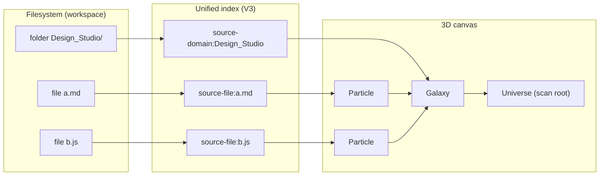
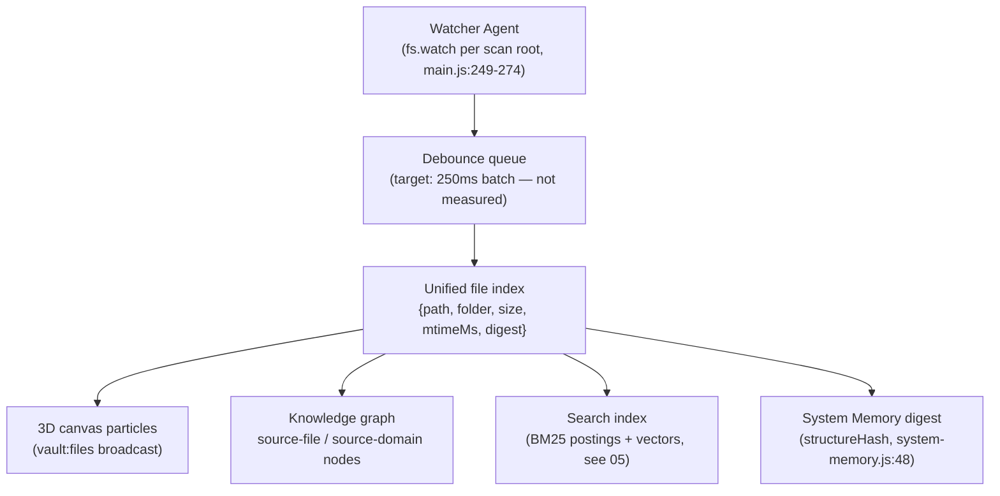
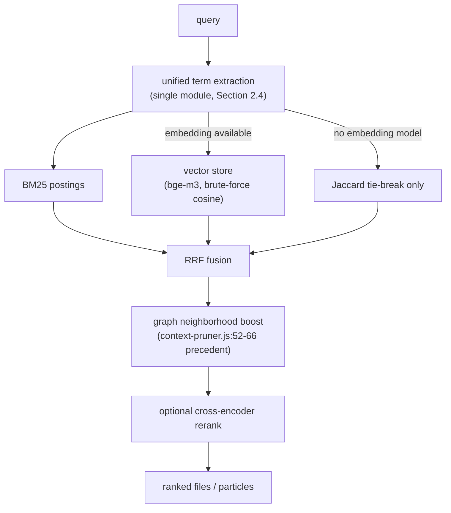

# V3 Architecture — 02. Living Knowledge Graph

Status: design specification (2026-08-02).
Discipline: every claim about current code carries a `file:line` reference. Numbers are
either measured (labelled) or targets (labelled). Per `src/domain/pi-core/system-instructions.md:31`
(Article 25): a number is stated only if it was measured; otherwise `not measured`.

---

## 1. Scope

This document specifies the Living Knowledge Graph for BigKiji Universe V3:

1. The persistent graph schema (`knowledge_graph.json`) and its evolution.
2. The mapping File → Particle, Folder → Galaxy, Workspace → Universe used by the 3D canvas.
3. The Watcher Agent structure that keeps the graph alive.
4. Search design (lexical + vector hybrid; GraphRAG explicitly rejected).

Cache mechanics (vector store format, semantic cache) live in `05-cache-layers.md`.

## 2. Current state (as-is, verified)

### 2.1 Knowledge root and write discipline

All knowledge files live under `<dataRoot>/knowledge` (ROOT resolution:
`src/domain/pi-agent/pi-knowledge-orchestrator.js:12-14`). Every write goes through
`writeJson()` (`pi-knowledge-orchestrator.js:38-43`): directory created with mode `0o700`,
file written with mode `0o600` to a `<file>.<pid>.tmp` path, then atomically renamed.
**V3 rule: every new persistent artifact (including vector stores) reuses this exact
write pattern.**

### 2.2 Persistent stores today

| File | Schema / owner | Caps |
|---|---|---|
| `task_state.json` (`pi-knowledge-orchestrator.js:15`) | `{version:2, project, tasks[], plans[], ideas[], events[], physicalLayout{}, fleetMetrics, updatedAt}` (`:28-31`) | tasks/plans last 100 (`:66-67`), events last 300 (`:84`), ideas last 200 (`:113`) |
| `knowledge_graph.json` (`pi-knowledge-orchestrator.js:16`) | `{version:2, project, nodes[], edges[], updatedAt}` (`:32-34`) | **nodes last 500 (`:123`), edges last 1000 (`:127`)** |
| `deliberation_memory.json` (`src/domain/pi-agent/deliberation.js:99`) | `{version:1, plans[]}` with keyword terms | plans last 120 (`deliberation.js:98,:112`) |
| `task_knowledge_base.json` (`src/core/main.js:985`) | swarm playbook patterns (`task-cache.js:174-188`) | patterns last 200 (`task-cache.js:189`) |
| `model_capabilities.json` / `model_performance.json` (`src/domain/pi-agent/model-capability-registry.js:30`) | provider capability/latency records | — |
| `skills.json` (`src/domain/pi-agent/skill-registry.js:309`) | scanned skill registry snapshot | — |

### 2.3 Graph schema today

Node id namespaces and relations, as written by `pi-knowledge-orchestrator.js`:

| Node prefix | Written at | Relation | Written at |
|---|---|---|---|
| `task:` | `:70` | `uses-plan` | `:72` |
| `plan:` | `:71` | `contains` | `:98` |
| `source-domain:` | `:93-94` | `produced-idea` | `:115` |
| `source-file:` | `:96-97,:116` | `promoted-to` | `:116` |
| `idea:` | `:114` | | |
| `session:` | `:115` | | |

Nodes are `{id, type, label(<=240 chars), updatedAt}` (`:119-123`); edges are
`{from, to, relation}` deduplicated on the triple (`:125-127`).

**Known defect: truncation is silent and order-based.** `graph.nodes.slice(-500)`
(`:123`) drops the *oldest-inserted* nodes, which may still be referenced by surviving
edges — `edge()` never checks that `from`/`to` exist. The V3 schema must make eviction
edge-consistent (Section 5).

### 2.4 Three independent file indexes (the integration problem)

Today three subsystems independently walk the filesystem and keep separate pictures of it:

| Index | Location | Schema | Persistence | Change detection |
|---|---|---|---|---|
| Vault file map | `src/core/main.js:209-230 scanVaultFiles()` | `{p, c, t, size}` | **memory only, never written to disk** | incremental `refreshVaultPaths()` `main.js:251-271` fed by `fs.watch` |
| System Memory | `src/domain/pi-core/system-memory.js:38-61` | `{path, digest}` per file, cap 5000 (`:21`) | JSON file | `digest = sha256(relative:size:mtimeMs:first-4096-chars).slice(0,20)` (`:46`) + `structureHash` (`:48`); skips the write when unchanged (`:66`) |
| Corpus Ingest | `src/domain/pi-core/corpus-ingest.js:145-176` | JSONL turn records | JSONL + state file | size+mtime incremental skip (`:160`) |

Corpus Ingest is **defined but never called** — grep for `CorpusIngest` outside its own
file returns zero hits (verified 2026-08-02).

Additionally, **CJK bigram term extraction is implemented three times**:

1. `src/domain/pi-agent/task-cache.js:39-49` — Latin words >= 3 chars + adjacent CJK
   bigrams, max 40 terms; matched with `jaccard()` (`task-cache.js:50-55`).
2. `src/domain/pi-agent/skill-registry.js:110-124` — same idea plus
   `pruneCommonTerms()` (`:236-246`, drops terms present in >40% of skills — a cheap
   IDF) and weighted scoring (`:251-277`).
3. `src/domain/pi-agent/context-pruner.js:18-21` — regex term extraction, max 24 terms,
   matched by naive substring inclusion (`:77`).

**V3 decision: one term-extraction module.** The `skill-registry.js` variant is the
richest (stopwords, IDF pruning, weighted scoring) and becomes the canonical
implementation; `task-cache.js` and `context-pruner.js` import it. This is a
prerequisite for the Jaccard fallback contract in `05-cache-layers.md` — a fallback is
only trustworthy if every caller tokenizes identically.

## 3. Mapping: File → Particle, Folder → Galaxy, Workspace → Universe

The 3D canvas already receives the vault file map via `broadcast('vault:files', vaultFiles)`
(`main.js:229`). V3 formalizes the mapping instead of inventing a new channel:

| Universe concept | Data source | Identity |
|---|---|---|
| **Particle** | one entry `{p, c, t, size}` from `scanVaultFiles()` (`main.js:223`) | `source-file:<relative path>` — the same id namespace the knowledge graph already uses (`pi-knowledge-orchestrator.js:96`) |
| **Galaxy** | top-level folder = `c` field (`rel.split('/')[0]`, `main.js:223`) | `source-domain:<folder>` (`pi-knowledge-orchestrator.js:93`) |
| **Universe** | a scan root from `scanRoots()` (`main.js:227`) | workspace root path |

Design consequences:

- **Shared identity is the whole point.** Because a Particle's id equals a
  `source-file:` graph node id, a click on a Particle can resolve graph neighbors
  (ideas promoted to that file, domains containing it) with a plain id lookup — no
  fuzzy path matching.
- Particle visual attributes derive from already-scanned fields: `size` → radius class,
  `t` (mtimeMs) → recency glow. No extra stat calls.
- Scan limits are inherited and stated: depth 4, 4200 entries (`main.js:212,:219`),
  `VAULT_EXCLUDE` filter (`main.js:184`). Beyond those limits the universe is
  intentionally incomplete rather than slow.



## 4. Watcher Agent structure

### 4.1 Today

`fs.watch` (FSEvents, recursive) already exists — one watcher per scan root, feeding
`refreshVaultPaths()` (`main.js:249-274`). But its output updates only the in-memory
vault map; System Memory rebuilds by full walk, and the knowledge graph learns about
files only when `savePhysicalLayout()` or `rememberIdea()` happen to mention them.

### 4.2 V3: one watcher, one index, many consumers



Rules:

1. **The index record is the union of what the three existing scanners need**:
   `{path, folder, size, mtimeMs, digest}`. The digest formula is inherited unchanged
   from `system-memory.js:46` so existing System Memory files remain comparable.
2. **Consumers subscribe; they never walk.** `scanVaultFiles()` remains only as the
   cold-boot seeding pass; after boot, all deltas come from the watcher.
3. **Persistence:** the unified index is written to `<dataRoot>/knowledge/file_index.json`
   using the atomic pattern (`pi-knowledge-orchestrator.js:38-43`) — fixing the current
   "vault map is memory-only" gap, so a restart does not need a full rescan to render
   the universe (it re-verifies lazily via mtime+size, the same trick as
   `corpus-ingest.js:160`).
4. **Corpus Ingest is either wired to this watcher or deleted.** Keeping a third,
   never-called scanner (Section 2.4) is not an option in V3.

### 4.3 Graph writes from the watcher

The watcher upserts `source-file:` and `source-domain:` nodes with `contains` edges —
the exact write path `savePhysicalLayout()` uses today (`pi-knowledge-orchestrator.js:92-99`).
File deletions remove the node *and its edges* (new behavior; see Section 5).

## 5. Schema evolution: version 2 → 3

Proposed `knowledge_graph.json` version 3 (backward-readable; loader already tolerates
missing fields, `pi-knowledge-orchestrator.js:48-51`):

```json
{
  "version": 3,
  "project": "bigkiji-universe",
  "nodes": [{ "id": "source-file:app/src/core/main.js", "type": "source-file",
              "label": "main.js", "updatedAt": "...", "degree": 4 }],
  "edges": [{ "from": "...", "to": "...", "relation": "contains", "updatedAt": "..." }],
  "updatedAt": "..."
}
```

Changes and rationale:

1. **Edge-consistent eviction.** Replace `nodes.slice(-500)` (`:123`) with: evict
   lowest-degree, oldest-updated nodes first, and cascade-delete their edges. A node
   still referenced by a fresh edge is not silently dropped.
2. **`degree` is maintained incrementally** (updated in `edge()`), so eviction needs no
   full scan.
3. **Caps become configuration, not constants.** 500/1000 stay the defaults. Raising
   them is cheap at this scale — the store is a single JSON file rewritten atomically —
   but the write cost grows linearly with node count; the rewrite latency at larger
   caps is `not measured`, so raising the default waits for a measurement.
4. **`updatedAt` on edges** enables the same recency-first eviction for edges.

## 6. Search design

### 6.1 Decision: no GraphRAG

GraphRAG is rejected for V3. Its published advantage appears at the ~100k-document
scale; BigKiji operates at thousands of files and hundreds of graph nodes — two orders
of magnitude smaller (2026 survey conclusion adopted by this project). The graph is
kept for *navigation and neighborhood expansion*, not as the retrieval engine.

### 6.2 Adopted: BM25 + dense vectors, fused with RRF, optional rerank

- **BM25** over the unified term extractor's output (Latin words + CJK bigrams,
  Section 2.4). The IDF pruning idea from `skill-registry.js:236-246` generalizes here
  into real BM25 IDF.
- **Dense retrieval** via the zero-dependency vector store defined in
  `05-cache-layers.md`, embeddings from `bge-m3` (pulled 2026-08-02; before that no
  embedding model existed locally and `/api/embed` was rejected for every model).
  At this corpus size, brute-force cosine over a `Float32Array` is sufficient; ANN
  indexes are deferred until the corpus grows by orders of magnitude.
- **Fusion: Reciprocal Rank Fusion (RRF), not weighted score addition.** BM25 scores
  and cosine similarities live on different scales; RRF fuses ranks and needs no
  calibration.
- **Optional cross-encoder rerank** of the fused top-k. External benchmark (arXiv
  2604.01733): hybrid + rerank reached Recall@5 = 0.816 vs 0.587 for pure dense
  retrieval. These are that paper's numbers on its datasets — BigKiji's own recall is
  `not measured` and must be benchmarked on local queries before rerank is enabled by
  default.
- **Graph neighborhood boost:** the precedent is `graphHints()`
  (`context-pruner.js:52-66`), which adds +20 score to files named by graph nodes
  (`:76`). V3 keeps the same shape: after RRF, results whose `source-file:` node is
  within 1 edge of a query-matched node get a rank bonus. The bonus size is a tunable,
  starting from the existing +20-equivalent; its effect on precision is `not measured`.

### 6.3 Degraded mode

When Ollama or `bge-m3` is unavailable, search runs BM25-only, with Jaccard over the
unified term sets as the tie-breaker — the exact fallback contract specified in
`05-cache-layers.md`. No code path may *require* embeddings.



## 7. Open design issues

1. **Vault map persistence** (Section 4.2 item 3) changes boot behavior; boot-time
   interaction with Progressive Boot is specified in `03-local-ai-boot.md`.
2. **Eviction telemetry:** V3 should record how often the caps actually evict
   (currently unknown — `not measured`) before tuning cap values.
3. **Bigram index memory footprint** at 4200 files is `not measured`; if it matters,
   postings can be capped per term, but no cap is set until measured.
