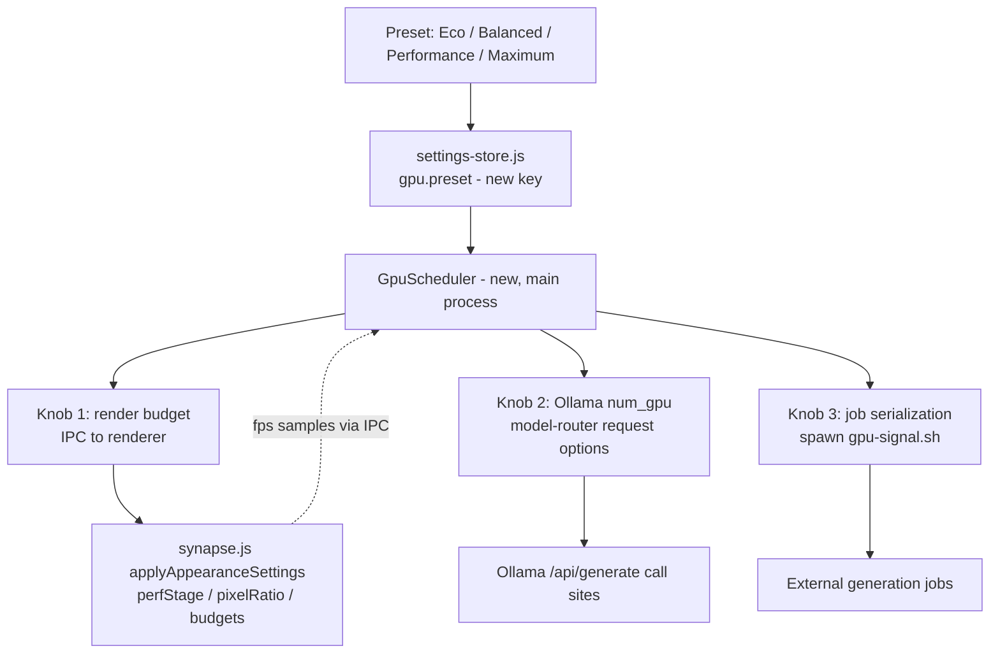

# 04 — Adaptive GPU Scheduler

Status: Design specification (V3). "Measured" statements were verified against the working tree
on 2026-08-02 with Read/grep. All preset numbers and targets are design labels — `not measured`
— unless a measurement source is cited.

---

## 1. Purpose

Give the owner one dial — Eco / Balanced / Performance / Maximum — that honestly governs how
much of the machine's GPU BigKiji is allowed to consume, across the three things that actually
consume it: the Three.js canvas, local LLM inference (Ollama), and external generation jobs
(image/video/music pipelines that share the same Apple-silicon GPU).

## 2. Measured baseline: what exists and what does not

### 2.1 What does not exist (grep, 0 hits each)

- `app.commandLine` / `appendSwitch` / `disableHardwareAcceleration` — the app never touches
  Chromium GPU flags.
- `Metal` — no native GPU API use anywhere in `src/`. The only `mps` reference is the Python
  TTS tool (`tools/qwen3-tts-server.py:25`), outside the Electron process.
- `num_gpu` — no Ollama request anywhere sets GPU layer counts.
- Any invocation of `gpu-signal.sh`. The registry entry at
  `src/domain/pi-agent/tool-registry.js:256-270` only *detects* the script (`kind: 'binary'`,
  `optional: true`, env `BIGKIJI_GPU_SIGNAL`) and deliberately sets `probe: null` — its
  comment states that running it would queue or thaw real jobs, so "presence on disk is all
  BigKiji claims to know."

The Settings UI is already honest about this: "without it BigKiji simply does not serialise
GPU jobs, rather than pretending it can" (`src/components/UI/settings-modal.js:174`).

### 2.2 What does exist (the only adaptive machinery today)

All of it lives in the renderer, in `src/domain/3d-canvas/components/synapse.js`:

| Mechanism | Behavior (measured) | Source |
|---|---|---|
| `perfStage` | quality tier 0..2 | `synapse.js:1134` |
| FPS tuner | 3 consecutive 1 s samples < 28 fps → stage++, > 45 fps → stage--, ceiling 2 | `synapse.js:2044-2045` |
| Priority pinning | `renderPriority: 'performance'` pins stage 2; anything else resets to 0 | `synapse.js:2057-2058` |
| Pixel ratio | cap 1.5 (performance) / 3 (otherwise); applied live | `synapse.js:77,2059` |
| Antialias | follows priority, but only on next launch (cached in localStorage) | `synapse.js:70-76` |
| Audio field budget | `POINT_BUDGETS = {auto:14000, performance:3200, graphics:26000}` | `audio-wave-field.js:31` |

`renderPriority` itself is a validated setting, default `'auto'`
(`src/core/settings-store.js:86,212-213`).

## 3. The honesty constraint

**Electron has no API to set or read "GPU utilization percent."** There is no knob that makes
the app use "15% of the GPU." Therefore:

- The V3 presets **Eco 15 / Balanced 35 / Performance 60 / Maximum 95** are *intent labels*.
  The numbers are naming, not telemetry. The UI must never present them as measured
  utilization, and no screen may show a utilization percentage unless a real sensor supplied
  it (§8).
- Each preset must be defined *only* as a bundle of the three real knobs below. What the
  preset did is always displayable in concrete terms ("pixelRatio 1.5, 3.2k audio points,
  num_gpu 8, jobs serialized") — never as a percent.

This continues the codebase's existing stance (`settings-modal.js:174`,
`tool-registry.js:267-269`): BigKiji does not claim control it does not have.

## 4. Architecture



`GpuScheduler` is a small main-process module. It owns no policy UI; it translates the preset
into knob values, pushes them, and records what it pushed (for the honest status line, §8).
Preset changes apply live, following the existing pattern where `applyAppearanceSettings`
re-tunes the renderer without a restart (`synapse.js:2050-2060`) — with the one measured
exception that antialias only changes on next launch (`synapse.js:70-71`).

## 5. Knob 1 — render budget (extends what exists)

The scheduler does not replace the FPS tuner; it sets the tuner's **floor, ceiling and
target**. Proposed mapping (initial values — design targets, `not measured`; tune on
hardware before freezing):

| Preset | renderPriority | perfStage floor..ceiling | Pixel ratio cap | Audio POINT_BUDGET | Frame pacing |
|---|---|---|---|---|---|
| Eco | performance | pinned 2 | 1.5 | 3,200 | render every 2nd frame (~30 fps target) |
| Balanced | auto | 0..2 (tuner) | 2 | 14,000 | uncapped, tuner-governed |
| Performance | auto | 0..1 | 3 | 14,000 | uncapped |
| Maximum | graphics | pinned 0 | 3 | 26,000 | uncapped |

Notes:

- Eco's frame pacing (render every Nth frame) is **new**; today the renderer always draws
  when the RAF fires. It must skip *renders*, not RAF ticks, so input and IPC stay live.
- Balanced is deliberately identical to today's `'auto'` defaults
  (`settings-store.js:86`, `audio-wave-field.js:31`) — the preset system must not change
  behavior for users who never open it (smart default = current behavior).
- The tuner's thresholds (28/45 fps, `synapse.js:2044-2045`) are not preset-dependent; only
  its allowed stage range is.

## 6. Knob 2 — local LLM GPU layers (new plumbing)

Measured: three call sites POST to Ollama `/api/generate` —
`src/domain/pi-agent/model-router.js:151` (endpoint overridable via `BIGKIJI_OLLAMA_ENDPOINT`,
`model-router.js:144`), `src/domain/pi-agent/local-qwen-guardrails.js:39`, and
`src/domain/pi-agent/task-cache.js:60`. None passes `options.num_gpu` (grep 0), so Ollama
always uses its own default layer offload today.

V3 plumbing: `GpuScheduler` exposes `gpuOptions()` and every Ollama request body merges it:

```json
{ "options": { "num_gpu": <per-preset> } }
```

Proposed mapping (initial values, `not measured` — correct values depend on the loaded model
and must be calibrated by observing tokens/sec and memory pressure):

| Preset | `num_gpu` intent |
|---|---|
| Eco | low fixed value (e.g. 8) — CPU-lean inference, GPU left for other apps |
| Balanced | omit the key — Ollama's default, identical to today |
| Performance | high fixed value (e.g. 999 = offload all layers) |
| Maximum | 999, plus job serialization guarantees exclusive GPU (§7) |

Rules: "Balanced omits the key" is mandatory — it keeps today's behavior bit-identical for
the default preset. Values are per-model-family overridable in settings, because layer counts
are model-dependent facts we have not measured.

## 7. Knob 3 — generation job serialization (activate what is detected)

Measured: the arbitration script is *detected but never executed*
(`tool-registry.js:256-270`, `probe: null`). The external contract (owner's workspace
tooling) is `gpu-signal.sh run <name> "<cmd>"` (blocking: queue → freeze Ollama → run →
auto-restore) and `gpu-signal.sh status`.

V3 behavior:

- When BigKiji itself launches a GPU-heavy external job, `GpuScheduler` wraps the command:
  `<gpu-signal.sh> run bigkiji-<job> "<cmd>"` — using the path resolved by the existing
  registry entry (settings key `tools.gpuSignal`, env `BIGKIJI_GPU_SIGNAL`,
  `tool-registry.js:260-266`).
- If the script is absent, behavior is **unchanged**: no serialization, and the UI keeps
  saying exactly that (`settings-modal.js:174`). Absence is not an error.
- Preset interaction: on Eco and Maximum, serialization is required when available (Eco to
  protect the rest of the machine, Maximum to protect the job); on Balanced/Performance it is
  used when available, skipped silently when not.
- The scheduler may call `status` for display, but must never call `run` as a probe —
  preserving the measured invariant that detection has no side effects
  (`tool-registry.js:267-269`).

## 8. Telemetry and honest status

- The status surface shows: preset name, the concrete knob values last applied, current
  `perfStage`, and the last FPS sample from the renderer's existing 1 s sampler
  (`synapse.js:2042-2047`) forwarded over IPC. FPS is the only *measured* number we have;
  it is labeled as renderer FPS, not "GPU %".
- A real GPU-utilization number can only come from a native sensor. That belongs to the
  SwiftUI helper `.app` (owner's hybrid decision): the helper may read IOKit/Metal
  performance counters and publish a read-only feed over local IPC. This is a **future,
  optional** input — the scheduler must function fully without it, and until it exists no
  utilization figure appears anywhere. Interface sketch: `{ ts, gpuBusyPercent }`,
  helper-signed, read-only. `not measured`, not scheduled.

## 9. Failure modes

| Failure | Required behavior |
|---|---|
| gpu-signal.sh missing/moved | Run unserialized; status says so (existing copy, `settings-modal.js:174`) |
| Ollama rejects `options.num_gpu` | Retry once without the key; log; keep preset otherwise active |
| Renderer never reports FPS (canvas closed) | Scheduler holds last knob values; no blind escalation |
| Preset flapping (user drags across presets) | Debounce apply ≥ 250 ms; knobs are idempotent absolute values, not deltas |
| Helper telemetry absent | Everything works; no utilization shown (never estimated) |

## 10. Why not Metal / native scheduling (boundary statement)

Direct GPU scheduling (Metal command-queue priorities, MPS) is impossible from Electron JS —
consistent with the measured absence of any such code (§2.1). V3 therefore scopes the
scheduler to the three knobs above, which are the *entire* set of GPU-relevant levers the
process actually holds. If the hybrid helper ever grows a native scheduling role, the
boundary is the same read-only telemetry channel of §8 plus, at most, a "request exclusive
GPU" advisory — the Electron side must remain correct when the helper is absent. See also
`06-rendering.md` §7-8 for the renderer-side native boundary.

## 11. Acceptance criteria (targets, `not measured`)

1. Balanced preset produces byte-identical Ollama request bodies and identical renderer
   settings to a build without the scheduler (regression-diff test).
2. Eco on a busy machine: canvas holds its paced target without tuner oscillation
   (verified by logging `perfStage` transitions, `synapse.js:2044-2045`).
3. With gpu-signal.sh present, two BigKiji-launched generation jobs never overlap
   (observed via the script's own queue/status output).
4. No UI string ever renders a GPU percentage unless helper telemetry supplied it.
5. Preset switch UI acknowledges < 300 ms; applying knobs is async and reported when done.
