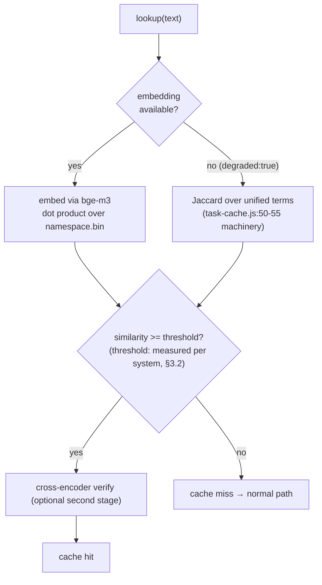

# V3 Architecture — 05. Cache Layers

Status: design specification (2026-08-02).
Discipline: per `src/domain/pi-core/system-instructions.md:31` (Article 25), a number is
stated only if it was measured. Measured numbers below are labelled with their
measurement method; everything else is a target or `not measured`. Claims about current
code carry `file:line` references.

---

## 1. Layer inventory — what exists, what does not

Honesty first: V3 documents the cache layers that actually exist and names the ones
that do not, instead of implying a stack that was never built.

### 1.1 Caches that exist today

| Layer | Location | Key / match | Persistence |
|---|---|---|---|
| Plan / playbook cache (swarm KB) | `src/domain/pi-agent/task-cache.js:129-163` (hit branch `:140-160`) | keyword Jaccard >= 0.5 (`:140`) against `intent_keywords` | `task_knowledge_base.json` (`src/core/main.js:985`), last 200 patterns (`task-cache.js:189`) |
| Deliberation cache | `src/domain/pi-agent/deliberation.js:117-126` | keyword Jaccard, threshold 0.5 (`:98,:123`) | `deliberation_memory.json` (`:99`), last 120 plans (`:112`) |
| Facilitator plan cache | `src/domain/pi-agent/pi-knowledge-orchestrator.js:76-79` (`findPlan`) | **exact `promptHash` match only** — sha256 prefix of the cleaned prompt (`:20-22,:77`) | `task_state.json` plans, last 100 (`:66`) |
| File read cache | `src/domain/pi-agent/context-pruner.js:25` (Map), `:28-33` (`read()`) | `mtimeMs:size` key (`:29-30`) | **in-process memory only** |

Observed structural facts:

- Two of the three semantic-ish caches (plan/playbook, deliberation) share the same
  keyword+Jaccard machinery — `deliberation.js:18` imports `keywords`/`jaccard`
  directly from `task-cache.js`. The facilitator cache does not: an owner prompt that
  differs by one character misses (`pi-knowledge-orchestrator.js:77`). This asymmetry
  is a design accident, not a decision.
- The 0.5 Jaccard thresholds were chosen, not measured. Hit precision at 0.5 is
  `not measured`.

### 1.2 Layers that do NOT exist (verified 2026-08-02)

| Missing layer | Evidence |
|---|---|
| **Prompt cache** (Anthropic `cache_control` style) | grep for `cache_control` over `src/` and `tools/`: 0 hits. Structural reason: paid providers are launched as CLI subprocesses with `--print`-style one-shot invocations (`src/domain/pi-agent/task-runner.js:274-291`); the app never speaks the provider HTTP API, so there is no request object to attach cache-control blocks to. |
| **Semantic cache** (embedding-similarity answer reuse) | No embedding call exists anywhere in `src/` (grep `api/embed` / `embedding`: 0 hits). Until 2026-08-02 no embedding model was even pulled — `/api/embed` was rejected for every installed model. `bge-m3` (MIT, Ollama official, 100+ languages, 8K context, dense+sparse) is now pulled but unused by code. |
| **KV cache management** | No code inspects or manages Ollama's KV/prefix cache. The only adjacent control is residency: `keep_alive:-1` for the chat model (`conversation-engine.js:127`, `model-router.js:51`), `keep_alive:'30m'` for planning calls (`task-cache.js:70`, `fast-api-router.js:37`), and explicit release with `keep_alive:0` (`model-router.js:53` tier config, `local-qwen-guardrails.js:40` reset). |

## 2. Zero-dependency vector store

V3 adds one vector store, with no new npm dependencies (dependency additions are
owner-approval gated — `BIGKIJI/CLAUDE.md`, app rules). Node's `fs`, `Buffer`, and
`Float32Array` are sufficient at this scale.

### 2.1 On-disk format

```
<dataRoot>/knowledge/vectors/<namespace>.bin    # Float32Array vectors, concatenated
<dataRoot>/knowledge/vectors/<namespace>.json   # sidecar manifest
```

Sidecar manifest:

```json
{
  "version": 1,
  "model": "bge-m3",
  "dim": 1024,
  "normalized": true,
  "entries": [
    { "id": "source-file:app/src/core/main.js", "mtimeMs": 1754000000000, "offset": 0 },
    { "id": "sem:1a2b3c4d5e6f", "textHash": "1a2b3c4d5e6f0708", "offset": 1 }
  ],
  "updatedAt": "2026-08-02T00:00:00.000Z"
}
```

Rules:

1. **`offset` is the vector's index**, so byte position = `offset * dim * 4`. The
   `.bin` file is exactly `entries.length * dim * 4` bytes; any mismatch on load marks
   the namespace corrupt and triggers a rebuild (embeddings are derived data — always
   rebuildable, never precious).
2. **Note on `dim`:** bge-m3's dense embedding dimension must be read from the model's
   actual `/api/embed` response at first use, not hardcoded — the value shown above is
   illustrative and `not measured` in this app.
3. **Atomic writes** follow `pi-knowledge-orchestrator.js:38-43` exactly: `0o700`
   directory, `0o600` files, `tmp → rename`. Write `.bin` first, `.json` second; a
   crash between the two leaves a stale sidecar whose offsets fail the length check in
   rule 1, which is the recovery path.
4. **Vectors are L2-normalized at insert** so cosine similarity is a dot product.
5. **Invalidation:** file-derived entries carry `mtimeMs`; semantic-cache entries carry
   `textHash`. An entry whose source mtime changed is dead on read (same mtime+size
   philosophy as `corpus-ingest.js:160` and `context-pruner.js:29-30`).

### 2.2 Search: brute force, on purpose

Query = one dot product per entry over a contiguous `Float32Array`. At BigKiji's scale
(thousands of files, hundreds of graph nodes — see `02-knowledge-graph.md` §6.1) this
is the correct engineering choice; ANN structures (HNSW etc.) are deferred until the
corpus grows by orders of magnitude. Actual query latency at 4200 entries:
`not measured` — to be benchmarked when the store is first populated.

### 2.3 Degradation contract (normative)

**Every consumer of the vector store MUST run without it.** If Ollama is down, the
model is missing, or `/api/embed` errors, the layer degrades to keyword Jaccard using
the unified term extractor (`02-knowledge-graph.md` §2.4) — the mechanism already
proven in `task-cache.js:50-55` and `deliberation.js:117-126`. Degradation is reported
(a `degraded:true`-style flag, following the precedent of
`conversation-engine.js:133`), never silent, and never an exception.



## 3. Semantic cache layer (new in V3)

### 3.1 What it caches

Namespace `sem:` in the vector store: prompt-embedding → stored result (plan, playbook,
deliberation outcome). It subsumes the two Jaccard caches' matching step — their
storage files and eviction caps stay as-is; only *lookup* gains a vector path with
Jaccard as the degraded mode. The facilitator cache's exact-hash lookup
(`pi-knowledge-orchestrator.js:76-79`) also gains the vector path, fixing the
one-character-miss problem noted in §1.1.

### 3.2 Threshold policy (normative)

**The similarity threshold MUST be measured on this system with this embedding model.
Thresholds from other systems MUST NOT be copied.** Evidence adopted from 2026 review:
MeanCache found the optimal threshold differs per embedding model (MPNet 0.83 vs
Albert 0.78), and GPTCache's suggested 0.7 was sub-optimal in that evaluation. Industry
starting range is 0.90–0.95; V3 therefore ships with a **provisional threshold of 0.92
(target, not measured)** and a calibration task that replays logged prompt pairs to
pick the real value. Until calibration has run, the semantic cache operates in
shadow mode: it logs would-be hits but does not serve them.

### 3.3 False-hit control

A wrong cache hit is worse than a miss (it silently serves a stale plan for a
different task). The most-validated countermeasure in the 2026 literature is a
two-stage design: vector similarity as the recall stage, a cross-encoder as the
verification stage — reported to cut false hits by 60–80% at 15–30ms added latency
(external numbers from that literature; BigKiji's own rates are `not measured`).
V3 adopts the two-stage shape but gates stage two on having a local cross-encoder
available; without one, the shipped mitigation is the conservative threshold plus
shadow-mode calibration.

## 4. Prompt cache layer

**Does not exist, and V3 does not pretend otherwise.** As long as paid providers are
driven through their CLIs (`task-runner.js:274-291`), provider-side prompt caching is
whatever the CLI itself does internally — outside this app's control and therefore
outside this spec's claims. The design position:

- If a provider path ever moves from CLI to direct API, prompt caching becomes a
  requirement of that migration, not an afterthought.
- The local analogue is Ollama's implicit prefix reuse for a resident model. The app's
  only lever is residency (`keep_alive`, §1.2), and V3 keeps it that way — no fake
  "prompt cache" abstraction over a mechanism the app cannot observe.

## 5. KV cache / residency layer

What the app actually controls is **which model is resident in VRAM**:

- Chat model pinned: `keep_alive:-1` (`conversation-engine.js:127`; tier declaration
  `model-router.js:51`).
- Planning calls: `keep_alive:'30m'` (`task-cache.js:70`, `fast-api-router.js:37`).
- Explicit release: `keep_alive:0` (`model-router.js:53`, `local-qwen-guardrails.js:40`)
  — required by the GPU signal discipline (one GPU workload at a time).
- Pre-warming: `warmModel()` (`model-router.js:143-162`), measured results in
  `03-local-ai-boot.md` §3. Measured on 2026-08-02 (isolated load time, residency
  confirmed via `ollama ps`): `qwen2.5:0.5b` cold 723ms → resident 139ms;
  `qwen3.5:latest` cold 4160ms → resident 260ms.

V3 names this the **residency layer** and stops there. Token-level KV cache reuse
inside Ollama is not observable from this app; no claims are made about it.

## 6. Layer summary

| # | Layer | V3 status | Backing |
|---|---|---|---|
| L1 | File read cache | exists, unchanged | in-process Map (`context-pruner.js:25`) |
| L2 | Exact-match plan cache | exists; gains L3 lookup path | `task_state.json` (`pi-knowledge-orchestrator.js:76-79`) |
| L3 | Semantic cache | **new**; shadow mode until threshold measured | `vectors/sem.*` (§2) + existing KB files |
| L4 | Prompt cache | **does not exist**; explicit non-goal while providers are CLI-driven | — |
| L5 | Residency layer | exists (`keep_alive` + `warmModel`) | Ollama |

## 7. Measurement plan (before any layer is promoted)

1. **Semantic threshold calibration** (§3.2): replay logged prompts, plot
   precision/recall vs threshold, pick the knee. Output stored beside the namespace
   sidecar.
2. **Brute-force query latency** at current corpus size (§2.2): `not measured`.
3. **Jaccard-vs-vector agreement rate** in degraded mode: `not measured`; determines
   whether degraded-mode hits should also be shadow-logged.
4. **Existing 0.5 Jaccard thresholds** (§1.1): re-evaluated with the same replay
   harness rather than assumed correct.
