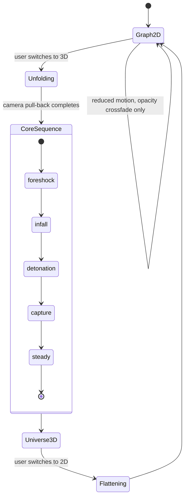
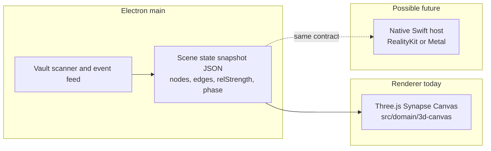

# 06 — Rendering: Synapse Physics, 2D ⇄ 3D Transition, Core Energy, and the Native Boundary

Status: Design specification (V3). All "Measured" statements were verified against the working
tree on 2026-08-02 with Read/grep. All "Target" numbers are design goals and are `not measured`
unless a measurement source is cited. Nothing in this document changes code by itself.

Owner decision (fixed input to this spec): **hybrid architecture** — Electron + Three.js remains
the body of the product; a SwiftUI helper `.app` is bundled only for Settings / notifications /
permissions. Consequences for RealityKit and Metal Compute are in §7 and §8.

---

## 1. Scope

This document specifies the V3 rendering architecture of the Synapse Canvas:

1. "Synapse Physics" — what motion model the universe actually uses, and what V3 adds.
2. The 2D Graph ⇄ 3D Neural Universe transition.
3. The Core Energy sequence (reusing the shipped 7-phase choreography).
4. Why RealityKit and Metal Compute are **not adopted**, and where the boundary sits if a
   native renderer is ever introduced.

Out of scope: GPU budgeting policy (see `04-gpu-scheduler.md`) and terminal/CLI surfaces
(see `08-cli-gui.md`).

## 2. Measured baseline

The entire 3D layer lives in `src/domain/3d-canvas/` (6,141 lines total). The scene owner is
`src/domain/3d-canvas/components/synapse.js` (2,462 lines).

| Concern | Measured fact | Source |
|---|---|---|
| Renderer | `THREE.WebGLRenderer({ antialias: renderPriority !== 'performance', alpha: true })` | `synapse.js:76` |
| Pixel ratio | capped at 1.5 (performance) / 3 (otherwise) | `synapse.js:77` |
| Tone mapping | `ACESFilmicToneMapping` | `synapse.js:78` |
| Fog | `FogExp2(0x05080f, 0.02)` | `synapse.js:83` |
| Camera | `PerspectiveCamera(46, 1, 0.1, 300)` | `synapse.js:90` |
| Controls | OrbitControls, `enableDamping = false`, rotateSpeed 0.42, minDistance 2.6 / maxDistance 34 | `synapse.js:98-111` |
| Focus easing | `zoomAroundPoint` + `SmoothFocusController` | `camera-controls.js:3,16` |
| Auto camera | opt-in, persisted under `bigkiji.camera.auto.v2` | `synapse.js:2096-2131` |
| Three.js | `three` `^0.172.0` | `package.json:127` |

Particle inventory (all measured constants):

| System | Count | Source |
|---|---|---|
| Stardust far field | `STARDUST_N = 30000` | `synapse.js:512` |
| Neural fibers (ambient) | `FIBERS = 56 × PER = 340` = 19,040 points | `synapse.js:585-586` |
| Background stars | 1,400 | `synapse.js:492` |
| Connection fibers | `FIBER_N = 260 × FIBER_SEG = 22` | `synapse.js:1011` |
| Spark shedder | capacity 768 | `synapse.js:1086` |
| Core inflow | `maxParticles: 512` | `synapse.js:664` |
| Core accretion | `count: 2600` | `synapse.js:665` |
| Relationship edges | `maxEdges: 180` | `synapse.js:84` |
| Audio wave field | `POINT_BUDGETS = {auto:14000, performance:3200, graphics:26000}` | `audio-wave-field.js:31` |

Drawing style: Points / LineSegments / Mesh / Sprite with `AdditiveBlending` in 20+ places,
always paired with `depthWrite: false` (e.g. `synapse.js:692,704`). Shaders are inline
GLSL strings (`STARDUST_VERT` at `synapse.js:513`, `FIBER_VERT` at `synapse.js:1013`).

Adaptive quality: `perfStage` (`synapse.js:1134`) is raised/lowered by an FPS tuner — three
consecutive 1-second samples below 28 fps raise the stage, three above 45 fps lower it, ceiling
2 (`synapse.js:2044-2045`). `renderPriority: 'performance'` pins stage 2; any other setting
resets to 0 and hands control back to the tuner (`synapse.js:2057-2058`).

## 3. Synapse Physics

### 3.1 What "physics" means here (measured)

There is **no physics simulation** in the current code. Verified by grep (0 hits each):
force-directed, barnes-hut, curl noise, perlin, boids, compute shader, GPGPU. The single
`spring` hit is a test string; all 11 `bezier` hits are CSS `cubic-bezier`. Instead:

- **Placement is deterministic**: `hash01(path)` (`synapse.js:181`, used at `:288-290,378-380`)
  and `radial-folder-geometry.js` derive stable orbits from file paths. The same vault always
  produces the same universe — this is a feature (spatial memory), not a limitation.
- **Motion is phase composition**: per-point `Math.sin/cos` with hashed phase/speed/amplitude
  (`synapse.js:425-429`). Stardust orbits are integrated **in the vertex shader** so 30k points
  cost only uniform updates on the main thread (comment at `synapse.js:510-511`).
- **Curves are hand-built**: desktop connection lines are LineSegments with a GLSL-evaluated
  bend (`synapse.js:1052-1084`); tubes use `CatmullRomCurve3` + `TubeGeometry`
  (`viral-membrane.js:42-52`); the only true Bezier class instance is
  `QuadraticBezierCurve3` in `remote/mobile.html:652` (mobile).

### 3.2 V3 decision: keep deterministic phase physics as the default

Rationale:

1. Determinism gives users a stable mental map of their vault. A force simulation re-solves
   layout every session and destroys spatial memory.
2. Vertex-shader integration is what lets a 30k-point far field run with `perfStage`-only
   CPU cost (`synapse.js:510-511`). Any CPU-side solver would trade that away.
3. The visual identity ("living but calm") comes from phase-locked drift, and reduce-motion
   support is trivial: amplitudes and speeds collapse to 0 (`synapse.js:427`).

### 3.3 V3 addition: optional GPGPU relaxation (graphics tier only)

For the relationship layer only (≤ 180 edges, `synapse.js:84`), V3 may add a light
force-relaxation pass so heavily-connected clusters visibly gravitate toward one another.
Because WebGL2 has **no compute shaders**, this is specified as classic **GPGPU: float-texture
ping-pong** — positions/velocities in two RGBA float render targets, a fragment shader
integrating one step per frame, swap each frame.

Constraints (design, target values `not measured`):

- Enabled only at `renderPriority: 'graphics'` and `perfStage === 0`; disabled by the tuner
  the moment stage rises.
- Simulation texture ≤ 64×64 (4,096 agents ceiling; actual need is ≤ 180 edges).
- Relaxation blends *on top of* the deterministic base position (lerp weight ≤ 0.3) so the
  universe never loses its stable layout; turning the feature off is visually continuous.
- Target cost: < 1 ms GPU per frame — `not measured`; must be profiled before enabling by
  default.

## 4. 2D Graph ⇄ 3D Neural Universe transition

### 4.1 Measured starting point: there is no 2D graph

Grep verified 0 hits for cytoscape / vis-network / sigma. All 47 `d3` hits are hex colors
(`#34d399` etc.). All 8 `getContext('2d')` uses are texture generation and sparklines. The 2D
graph view is therefore a **new V3 surface**, not a port.

### 4.2 Decision: one scene, two projections — no second data model

The 2D graph is **the same Three.js scene rendered flat**, not a separate library:

- Camera interpolates from `PerspectiveCamera(46,…)` (`synapse.js:90`) toward a
  quasi-orthographic framing (narrow FOV + distance compensation, or a true
  `OrthographicCamera` swap at the midpoint — implementation may choose either; the contract
  is that node identity and screen-space adjacency are preserved).
- Node positions flatten by lerping Y toward a layout plane; the deterministic hash layout
  (§3.1) already provides stable 2D coordinates when projected.
- Labels/sprites already exist in-scene; no DOM graph is introduced.

Why: a dedicated 2D graph library would duplicate the vault model, the selection model, and
the event feed, and the ⇄ transition would become a cross-technology crossfade instead of a
continuous camera move. One scene means the transition is *literally the same objects*.

### 4.3 Choreography: the 3D reveal reuses the shipped core sequence

The awakening sequence already exists and is complete (`synapse.js:667-670`): 

`dormant → foreshock → infall → detonation → capture → steady → ringmorph (progress ≥ 70) → finale`

with measured durations `SEQ = { foreshock: 900, infall: 2600, detonation: 430, capture: 1400,
finale: 800 }` ms (`synapse.js:671`). Entry point `triggerCoreAwakening()` (`synapse.js:714`),
finale `beginCoreFinale()` (`synapse.js:841`). There is **no splash screen** (grep 0 for
splash/boot/intro/preloader); load feedback is the pixel-art cat (`main.html:244-248`).

V3 rule: the 2D → 3D transition **does not introduce a new cinematic**. It is:

- **Unfolding (new)**: nodes lerp from the layout plane to their hashed 3D orbits while the
  camera pulls back. Target duration 600–900 ms — `not measured`; tune on hardware.
- **CoreSequence (reused)**: if the core is dormant, the existing `foreshock → … → steady`
  phases play as the second half of the transition. No new timing constants; `SEQ` stays the
  single source of truth (`synapse.js:671`).
- **Flattening (3D → 2D)**: the inverse camera move plus Y-collapse. Target 500–700 ms,
  `not measured`. No core sequence on the way down — leaving should always be faster than
  arriving.

### 4.4 Motion discipline

- The mode switch **control** must acknowledge within < 300 ms (chip state flips immediately,
  `transform`/`opacity` only, ease-out). The 3D narrative itself is the sanctioned exception
  to the 300 ms UI rule — it is a story beat, not feedback.
- `prefers-reduced-motion`: the scene already listens (`reducedMq`, `synapse.js:24`) and the
  awakening collapses to a direct `capture` entry (`synapse.js:724-726`). The 2D ⇄ 3D
  transition follows the same pattern: **opacity crossfade, no camera flight, no core
  cinematic** when reduced motion is set.
- Never start any element from `scale(0)`; the sequence already spawns rings at scale 0.08
  and the core at 0.025 (`synapse.js:687,722`) — keep that convention (appear small, not
  from nothing).
- OrbitControls damping stays off (`synapse.js:100`) — input stops mean motion stops.

## 5. Core Energy sequence

The Core Energy production is **the shipped 7-phase machine**; V3 changes only what feeds it:

| Aspect | Spec | Source |
|---|---|---|
| Phases and order | as in §4.3, unchanged | `synapse.js:667-670` |
| Durations | `SEQ` values, unchanged | `synapse.js:671` |
| Pull/absorb coupling | `coreSeq.pull` drags file clouds inward, `coreSeq.absorb` dims leaves during infall | `synapse.js:676-678` |
| Ring morph trigger | `progress >= 70` | `synapse.js:669` |
| Energy source (V3) | relationship strength = accumulated real events + measured tokens, already computed by `relStrength()` | `synapse.js:1135-1136` |

V3 rule of honesty: core brightness/inflow rate must be derived from **real activity**
(`relStrength`, `synapse.js:1136`) — never a decorative random pulse. The existing code
already follows this ("visible fiber count = relationship depth", comment at
`synapse.js:1010`); V3 extends the same rule to the core glow.

## 6. Audio-reactive layer

Measured facts:

- `AnalyserNode` exists: created at `audio-engine.js:27` (path
  `src/components/UI/audio-engine.js`), `fftSize = 512` (`:28`), smoothing 0.72 (`:29`).
- At fftSize 512 the bins are ~86 Hz wide and **cannot resolve pitch**; the shipped code
  therefore announces the cue id and derives hue from the SFX manifest instead of the
  spectrum (measured comment, `audio-engine.js:75-79`; `MEASURED_HUES` at
  `audio-wave-field.js:27` are real per-pitch measurements from a reference clip).
- Helpers available: `dominantBin()` (`audio-wave-field.js:82`), `averageLevel()`
  (`audio-wave-field.js:94`).
- **Beat detection is not implemented** (grep 0).

V3 spec: intensity comes from `averageLevel()`, hue from cue id / `MEASURED_HUES` — never
from spectrum color at fftSize 512. If spectral color is ever wanted, the fftSize must be
raised and the latency/CPU cost measured first (`not measured`; do not raise speculatively).
Beat detection stays out of scope until an implementation exists and is measured.

## 7. RealityKit — not adopted

Owner decision: hybrid (Electron + Three.js body; SwiftUI helper for Settings/notifications/
permissions only). RealityKit is **rejected for V3** because:

1. **No embedding path.** RealityKit renders into native views; it cannot render inside an
   Electron `BrowserWindow`. Adopting it means replacing the shell, not extending it.
2. **It would fork 6,141 lines of shipped, tuned scene code** (`src/domain/3d-canvas/`),
   including the awakening machine (§4.3) and the FPS tuner — with no user-visible gain that
   has been measured.
3. **The look is shader-defined.** The identity of the universe is additive-blended points
   and inline GLSL (§2); reproducing it in RealityKit materials is a rewrite, not a port.
4. The helper `.app`'s charter is deliberately narrow (Settings/notifications/permissions);
   giving it a renderer would collapse the hybrid boundary.

### 7.1 The future boundary, if a native renderer is ever built

The swap line is a **scene-state contract**, not a code boundary:

Rule: everything the renderer needs must be expressible as that snapshot (deterministic hash
inputs, relationship strengths, phase machine state). The current code is already close —
placement is pure `hash01(path)` (`synapse.js:181`) and energy is pure `relStrength(id)`
(`synapse.js:1136`). Keeping renderer inputs serializable is a V3 architectural requirement
precisely so this door stays open without committing to it.

## 8. Metal Compute — not adopted

Measured: there is **zero** GPU-API control in the codebase — `Metal`, `appendSwitch`,
`app.commandLine`, `disableHardwareAcceleration` all grep 0. The only `mps` hit is the Python
TTS server (`tools/qwen3-tts-server.py:25`), which is outside the Electron process.

Rejection reasons:

1. Electron/Chromium exposes no direct Metal or MetalPerformanceShaders API to JS. Reaching
   Metal requires a native addon or the helper `.app` — both violate the "renderer stays in
   the Electron body" decision (§7).
2. Every workload we actually have fits WebGL2: the heavy path (30k stardust) already runs
   as vertex-shader integration (§3.1), and the one compute-shaped need (relationship
   relaxation) is served by GPGPU float-texture ping-pong (§3.3).

Future boundary: same as §7.1 — if a native host ever exists, Metal compute lives behind the
scene-state contract. A nearer-term, still-in-Electron option is **WebGPU** (compute shaders
in Chromium); it may be evaluated when the GPGPU path of §3.3 is profiled and found wanting.
No performance claim is made for either — `not measured`.

## 9. Vibrancy / backdrop-filter ruling (measured facts, then the rule)

Measured on 2026-08-02:

- All three windows (`new BrowserWindow` appears exactly 3 times in `src/core/main.js`) set
  **no `vibrancy` option**: tray window (`main.js:360-372`, `transparent: true`), main window
  (`main.js:393-398`, opaque `#05080f`), setup window (`main.js:1069-1076`, deliberately
  opaque per its own comment at `main.js:1067-1069`).
- `backdrop-filter` **is used** in `tray.html` at lines 181 and 248 — while the same file's
  comment at `tray.html:21-22` says CSS backdrop-filter must never be used because vibrancy
  owns the frosted glass (glass-lab measurement / electron#39529).

So: the two backdrop-filter usages contradict the file's own stated rule, but **no
vibrancy+backdrop-filter conflict is currently live** because vibrancy is unset everywhere.

V3 rule (owner's standing rule, measured basis electron#39529): the two never coexist.
Concretely — before any window ever sets `vibrancy`, the `backdrop-filter` declarations at
`tray.html:181` and `tray.html:248` must be removed in the same change. Until then, the
in-page blur is tolerated as a self-contained effect. Track this as V3 debt item R-1.

## 10. Acceptance criteria

All are **targets**, `not measured` until profiled on the owner's hardware:

1. 2D ⇄ 3D switch: control acknowledgment < 300 ms; full transition ≤ 1.0 s (2D→3D without
   core sequence) / ≤ 3.5 s (with core sequence, bounded by `SEQ` sums); 3D→2D ≤ 0.7 s.
2. Steady-state frame rate: the existing tuner's own thresholds are the contract — no state
   may hold `perfStage 0` while sustaining < 28 fps (`synapse.js:2046`).
3. Reduced motion: no camera flight, no cinematic, crossfade only; verified by toggling the
   OS setting, not by code review.
4. GPGPU relaxation (§3.3) ships default-off until its frame cost is measured.
5. R-1 (backdrop-filter debt) is resolved before any vibrancy adoption.
