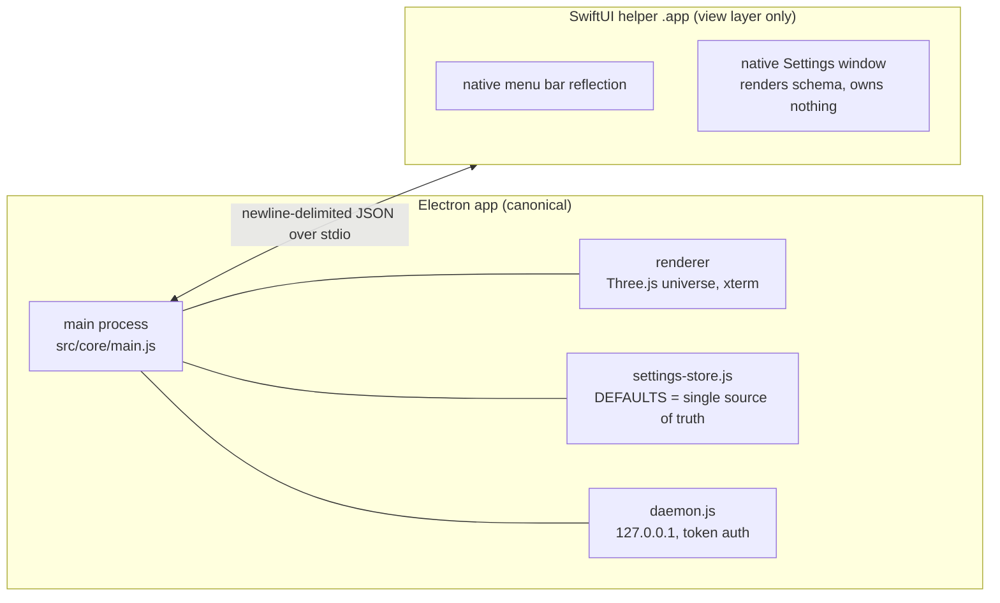

# 07 — Native Shell (Hybrid Boundary, SwiftUI Helper)

Status: V3 design. The SwiftUI helper described here **does not exist yet** — this
document defines the boundary before any Swift is written. Claims about current code
cite `file:line`; claims about the local machine were measured on 2026-08-02.

## 1. Current state — measured, not assumed

- **Apple-native assets are exactly zero.** `find`/`grep` across the repo return no
  `.swift`, `.xcodeproj`, `.metal` files and no `RealityKit` / `Metal` /
  `MetalPerformanceShaders` references (0 matches, verified 2026-08-02).
- Local toolchain (measured on this machine, 2026-08-02): Xcode 26.6 (Build 17F113),
  Swift 6.3.3, `/usr/bin/swiftc` present.
- Code signing: `security find-identity -v -p codesigning` shows **one** identity —
  the self-signed `BigKiji Universe Dev Signer`. **There is no Developer ID
  certificate on this machine.**
- The app is pure Electron: Electron ^43.2.0, Three.js ^0.172.0, xterm, node-pty
  (`package.json` dependencies), with Win/Linux build targets alongside macOS
  (`build.win`: nsis+zip, `build.linux`: AppImage+deb).

Everything below is therefore an addition, not a refactor.

## 2. Why a hybrid shell, and where the boundary sits

The Electron process owns everything that must behave identically on macOS, Windows,
and Linux: the daemon, the Pi agent pipeline, the security layers, the Three.js
universe renderer, the terminal. The SwiftUI helper exists for exactly one reason —
the places where macOS users feel non-nativeness: the menu bar, Settings, and
system-integrated chrome.

**Boundary rule**: the helper is a *view* onto state that lives in Electron. It holds
no business logic, no security decisions, no persistent state, and no network access.
If the helper crashes or is absent (Windows, Linux, or a build without it), the
existing JS UI is the fallback and nothing is lost but polish.

## 3. Stage 0 — a real application menu comes first

Measured gap: **the app currently has no macOS application menu at all.**

- `Menu.setApplicationMenu` — 0 matches in `src/` (grep-verified).
- The only `Menu.buildFromTemplate` call is the tray right-click menu with Open/Quit
  (`src/core/main.js:420`).
- Settings can only be opened from inside the renderer: a `keydown` handler for
  `⌘,` in `src/components/UI/settings-modal.js:404`.

A SwiftUI helper that mirrors a menu which does not exist would be building the second
floor before the first. **Stage 0 is plain Electron work**: define the canonical menu
(App / File / View / Window / Help, `⌘,` bound at the menu level, not in a renderer
listener) via `Menu.setApplicationMenu`. This ships value on all three platforms,
costs no signing complexity, and becomes the specification the helper later reflects.
Only after Stage 0 does the helper have something to be native *about*.

## 4. Helper responsibilities — and explicit non-responsibilities

| In scope (view/controller only) | Out of scope (stays in Electron) |
|---|---|
| Native Settings window rendering the settings schema | Settings storage, validation, defaults (`src/core/settings-store.js`) |
| Menu bar reflection of the Stage 0 menu | Menu semantics, command dispatch |
| Native About panel, dock menu | Daemon, Pi agent, security policy, task running |
| System appearance signals (if needed beyond Electron's) | All rendering of the universe (Three.js stays) |
| — | Terminal (node-pty runs in the Electron main process only) |
| — | Any network access, any file writes |

## 5. Settings: one schema, two renderers, zero drift

The canonical settings live in `src/core/settings-store.js` — `DEFAULTS` at
`settings-store.js:15` with **10 groups**: `audio`, `routing`, `conversation`,
`quality`, `preview`, `appearance`, `piAgent`, `terminal`, `paths`, `cmux`
(grep-verified). The existing JS settings UI is `src/components/UI/settings-modal.js`.

The failure mode to design against is two hand-maintained settings UIs drifting apart.
Therefore:

1. Electron exports a **machine-readable schema** derived from `DEFAULTS` (group, key,
   type, range/enum, label key). This export is new work but small, because `DEFAULTS`
   is already the single normalization point (e.g. `settings-store.js:141-155` rebuilds
   a malformed `paths` group from `DEFAULTS`).
2. The SwiftUI helper **renders the schema generically** — it never hard-codes a
   setting. A new setting added to `DEFAULTS` appears in both UIs with no Swift change.
3. Writes flow one way: helper → IPC `settings.set {group, key, value}` → Electron
   validates against the same normalization used today → broadcast of the new snapshot
   to all views (helper included).
4. **Windows/Linux keep `settings-modal.js` unchanged** — schema-driven rendering can
   later be applied there too, but it is not a V3 requirement.

## 6. IPC contract

Transport: **newline-delimited JSON over the helper's stdin/stdout**, spawned and
supervised by the Electron main process. This is chosen over connecting the helper to
the daemon's HTTP/WS surface deliberately:

- No new network listener, no token handling in a second codebase — consistent with
  the security posture in `09-security.md` (the daemon's HTTP surface is already the
  largest attack surface; the helper should not widen it).
- Lifecycle is automatic: the helper dies with its pipe when Electron exits, and
  Electron restarts it on crash (with backoff) exactly like other supervised children.
- The message shape mirrors what the codebase already does elsewhere — the security
  hook and provider policies are file/stdio based, and the Pi RPC mode is stdio.

Message families (design):

| Direction | Message | Purpose |
|---|---|---|
| E → H | `hello {schemaVersion, settingsSchema, settingsSnapshot, menuModel}` | boot state |
| E → H | `settings.changed {snapshot}` | keep the native window truthful |
| E → H | `menu.changed {menuModel}` | Stage 0 menu is the source |
| H → E | `settings.set {group, key, value}` | the only write path |
| H → E | `command {id}` | menu/About actions, dispatched to existing handlers |
| both | `ping` / `pong` | supervision |

Versioning: `schemaVersion` is checked at `hello`; a mismatch disables the helper and
falls back to the JS UI rather than guessing.

## 7. Signing, notarization, distribution

Current build configuration (all verified in `package.json`):

- `build.mac`: `hardenedRuntime: true`, `forceCodeSigning: true`, `notarize: true`,
  two entitlements files (`build/entitlements.mac.plist`,
  `build/entitlements.mac.inherit.plist` — both exist in `build/`), targets dmg+zip,
  microphone usage description.
- `asar: false` — the app ships as plain files; the helper is unaffected by asar
  packing concerns.
- `build.extraResources` already exists (it copies `three/examples/jsm`), so embedding
  a helper `.app` under `Contents/Resources/` is an addition to an existing mechanism,
  not a new one.
- Scripts: `dist:mac` (full sign + notarize via keychain profile `BigKijiNotary`) and
  `dist:local` (`--dir`, identity `BigKiji Universe Dev Signer`, `notarize=false`,
  `forceCodeSigning=false`).

Consequences for the helper — stated honestly:

1. **A nested `.app` must itself be signed and notarized** for the outer app to pass
   Gatekeeper. Signing order is inside-out: helper first, then the Electron app bundle.
2. **This machine cannot produce a distributable build.** With only the self-signed
   identity, `dist:mac` (hardened runtime + notarization) cannot complete here; the
   full pipeline is gated on acquiring a Developer ID. Until then, local development
   runs through `dist:local`, and helper testing rides the same self-signed path.
3. The helper inherits the sandbox/entitlements story via
   `entitlementsInherit`; the helper itself needs no entitlements of its own under the
   §4 scope (no network, no file access, no devices).
4. Win/Linux builds simply omit the helper; no conditional code beyond "helper
   available?" at startup.

## 8. Build integration (design)

- `native/helper/` — Swift Package or minimal Xcode project, built by a script step
  (`swift build` / `xcodebuild`) before `electron-builder` runs; output `.app` staged
  into `build/` and referenced from `extraResources`.
- CI/dev guard: if Xcode is absent or the build fails, packaging continues **without**
  the helper and the app runs with the JS UI — the helper is enhancement, never a
  dependency.
- No npm dependency changes are required for any of this (owner approval gate on
  dependencies remains untouched).

## 9. Risks

| Risk | Position |
|---|---|
| Dual settings UIs drift | Prevented structurally: schema-driven rendering (§5), never two hand-written forms |
| Helper crash loops | Supervised spawn with backoff; permanent fallback to JS UI after N failures |
| Notarization pipeline untestable locally | True today (no Developer ID). Accepted; `dist:local` covers development, full pipeline validated once the certificate exists |
| Scope creep into a second app | The §4 out-of-scope column is normative; any proposal to move logic into Swift requires a design revision to this document |
| Menu semantics forked between platforms | Stage 0 menu model is defined once in Electron and reflected, not reimplemented |

## 10. Staging summary

1. **Stage 0 (Electron only)**: real `Menu.setApplicationMenu` menu; `⌘,` moves from
   the renderer listener (`settings-modal.js:404`) to a menu accelerator. Ships on all
   platforms.
2. **Stage 1**: settings schema export + schema-driven rendering proof inside the
   existing JS modal (validates the schema without any Swift).
3. **Stage 2**: SwiftUI helper — native Settings window + menu reflection over stdio
   IPC, self-signed local builds.
4. **Stage 3**: Developer ID acquired → inside-out signing + notarization wired into
   `dist:mac`; helper ships in distributable builds.
