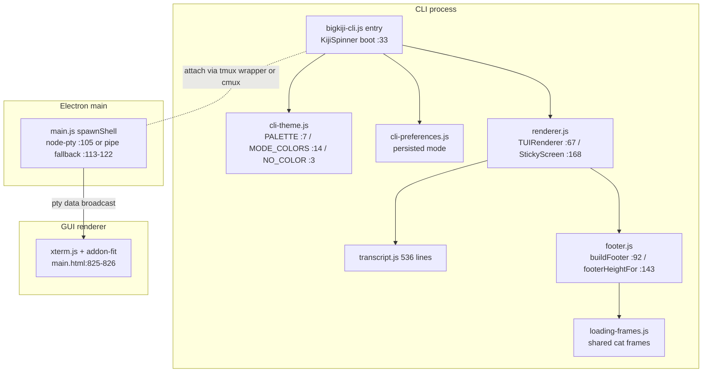

# 08 — CLI / GUI: Developer & Creator Modes, Terminal Multiplexing, CLI Structure

Status: Design specification (V3). "Measured" statements were verified against the working tree
on 2026-08-02 with Read/grep. Targets are `not measured` unless a measurement source is cited.

---

## 1. Measured inventory

### 1.1 CLI / TUI modules

| File | Lines | Key symbols (measured) |
|---|---|---|
| `src/cli/tui/transcript.js` | 536 | transcript model/rendering |
| `src/cli/tui/renderer.js` | 244 | `TUIRenderer` (:67), `StickyScreen` (:168) |
| `src/cli/tui/loading-frames.js` | 162 | pluggable frame sets (the animated cat) |
| `src/cli/tui/footer.js` | 145 | `buildFooter` (:92), `footerHeightFor` (:143) |
| `src/cli/tui/monitor.js` | 57 | resize/monitor glue |
| `src/domain/terminal/bigkiji-cli.js` | 269 | `KijiSpinner` (:33; design note :30-32 — spinner writes to stdout because stderr bypassed the sticky DECSTBM region and corrupted the screen) |
| `src/domain/terminal/cli-theme.js` | 34 | `NO_COLOR` (:3), `PALETTE` warm-brown truecolor (:7), `MODE_COLORS` ask / auto-edit / plan (:14) |
| `src/domain/terminal/cli-preferences.js` | 40 | persisted CLI prefs (mode, etc.) |

### 1.2 GUI terminal stack

- `@xterm/xterm` `^5.5.0` + `@xterm/addon-fit` `^0.10.0` (`package.json:121-122`), loaded as
  UMD scripts straight from `node_modules` (`src/components/UI/main.html:825-826`; stylesheet
  at `:6`). Multi-terminal glue: `multi-terminal-manager.js` and `terminal-resizer.js`
  (`main.html:827-828`).
- `node-pty` declared `^1.0.0` (`package.json:125`), installed 1.1.0
  (`node_modules/node-pty/package.json`). The shell spawns via node-pty
  (`src/core/main.js:105-110`); if the native module fails to load, the app **degrades to
  pipe mode** — plain `child_process.spawn` with stdout/stderr piping, a stub `resize`, and
  a system feed message announcing the downgrade (`src/core/main.js:113-122`).

### 1.3 Bottom pane and view controls (main window)

- Pane tabs: NEURAL / MISSION RELAY / SESSIONS / pinned BIGKIJI SESSION / cmux surface tabs /
  add-terminal / PREVIEW / task-stream tabs (`main.html:737-745`).
- Pane bodies: `#terminal`, `#liveRelay`, `#taskPanel`, `#previewPane`, `#taskStreams`
  (`main.html:775-782`).
- 3D view distance chips: SYSTEM / FILES / CLOSE / AUTO (`main.html:700-704`).

## 2. Mode taxonomy today (measured)

"Developer mode" and "Creator mode" **do not exist under those names** — grep for
developerMode / creatorMode / "developer mode" / "creator mode" returns 0 hits. What exists
is four independent axes:

| Axis | Values | Source of truth |
|---|---|---|
| CLI interaction mode | `plan` / `ask` / `auto-edit` (with `auto`, `manual`, `shell` normalized to `auto-edit`) | `cli-theme.js:14-25` (`MODE_COLORS`, `normalizeMode`) |
| Execution mode | `plan` / `auto` / `manual` | `settings-store.js:48`, validated at `:190` |
| Render priority | `auto` / `performance` / `graphics` | `settings-store.js:86`, validated at `:212-213` |
| Bottom pane | NEURAL / TERMINAL / PREVIEW (+ relay/sessions/streams) | `main.html:737-745,775-782` |

Each CLI mode carries its own color identity (`MODE_COLORS`, `cli-theme.js:14-18`), so mode is
already a *visible* state, not a hidden flag.

## 3. Developer / Creator modes (V3 design)

### 3.1 Principle: personas are presets over the existing axes

V3 does **not** introduce a fifth state variable that the four axes must stay consistent
with. A persona is a named bundle of axis values, applied once; the axes remain the single
source of truth afterwards. This avoids the classic drift bug (persona says Creator, axes say
otherwise) by construction: the persona chip merely *reflects* whether the current axis
values still match a bundle.

| Axis | Creator | Developer |
|---|---|---|
| CLI interaction mode | `ask` (converse first) | `auto-edit` (act first) |
| Execution mode | `plan` | `auto` |
| Render priority | `graphics` | `auto` |
| Default bottom pane | NEURAL (the universe is the workspace) | TERMINAL (the shell is the workspace) |
| 3D view chip | SYSTEM + AUTO camera | FILES |

Values above are initial defaults (design intent, `not measured` against user behavior; revisit
after real usage). Storage: one new settings key `ui.persona` recording the last-applied
bundle name, `'custom'` when any axis has since diverged. No axis value moves out of its
current store location.

### 3.2 Persona switch UX (product-design discipline)

- Segmented control (Creator | Developer) in the header, plus the same command in the CLI
  (`/persona creator|developer`).
- Switch acknowledgment < 300 ms: the segment thumb slides with `transform` only, ease-out,
  ~160 ms; pressed state `scale(0.97)`. Pane/priority changes apply immediately after —
  render priority is already applied live by `applyAppearanceSettings`
  (`synapse.js:2051-2062`).
- No animation from `scale(0)`; no keyboard-triggered animation (switching persona by
  keystroke swaps state instantly).
- `prefers-reduced-motion`: thumb jumps without sliding.
- Smart default: first launch = Creator (the product's identity surface), but if the user's
  first three sessions end with the terminal pane focused, offer Developer once — an honest
  default nudge, never auto-switching behind the user's back.

## 4. tmux vs cmux (measured facts, then decision material)

### 4.1 What each actually is (measured)

- **tmux path**: `tools/bigkiji-tmux` is a 6-line zsh wrapper —
  `exec tmux new-session -A -s bigkiji <dir>/bigkiji` — for Termius/SSH use. Its own comment
  states the division of labor: processing lives in the resident Electron app; tmux only
  keeps the CLI attached across disconnects. There is **no in-repo tmux implementation**.
- **cmux path**: `src/core/cmux-bridge.js` (181 lines) bridges to the external macOS
  multiplexer **cmux**: command groups (`:12-20`), a `DANGEROUS` confirmation regex (`:11`),
  argv-only execution via `execFile` — never a shell (`:22-27`), and macOS-gating
  (`supported: process.platform === 'darwin'`, `:39`; polling refuses off-darwin, `:57`).
  UI: the "CMUX CONTROL PLANE" settings page (`settings-modal.js:272`) and surface tabs in
  the main window (`main.html:742`); screen mirroring via
  `src/domain/terminal/components/cmux-terminal-mirror.js`.
- **The overlap is real**: cmux's own remote command group includes `ssh`, `ssh-tmux`, and
  `ssh-session-*` (`cmux-bridge.js:18`) — i.e. cmux can drive the same remote-persistence
  scenario the tmux wrapper exists for.

### 4.2 Decision matrix (consolidation is an open owner decision)

| Criterion | tmux wrapper | cmux bridge |
|---|---|---|
| Platform reach | any POSIX host (SSH target included) | macOS only (`cmux-bridge.js:39`) |
| Dependency weight | 6 lines + system tmux | 181-line bridge + external cmux app |
| In-app integration | none (terminal-side only) | tabs, mirror, settings page, safety layer |
| Remote/SSH story | its entire purpose | `ssh-tmux` command exists; depth unverified in-repo |
| Failure isolation | trivial (exec or fail) | bridge polling + confirmation flow |
| Security posture | inherits shell | argv-only, dangerous-command confirmation (`:11,:22-27`) |

### 4.3 V3 recommendation (explicitly *not* a decision)

Short term, keep both with **disjoint charters**: cmux = local multiplexing control plane
(GUI-integrated, macOS); `bigkiji-tmux` = remote attach-survival for SSH clients. They do not
conflict today because they operate on different sessions.

Consolidation trigger: if cmux's `ssh-tmux` (`cmux-bridge.js:18`) is validated end-to-end for
the Termius workflow, the 6-line wrapper becomes redundant and can be retired; if cmux is
ever dropped or a non-macOS host matters, tmux is the survivor. Decision inputs the owner
needs before choosing: (a) a real test of `ssh-tmux` against the phone workflow, (b) cmux's
long-term availability as an external dependency, (c) whether GUI surface tabs
(`main.html:742`) are load-bearing for daily use. Track as V3 open item T-1.

## 5. CLI structure

Structural rules V3 keeps (all grounded in measured behavior):

1. **One frame source for all cat animation**: the boot spinner and the REPL footer share
   `loading-frames.js` (comment at `bigkiji-cli.js:30-32`) — any new loading state reuses it.
2. **Sticky regions own the bottom of the screen**: `StickyScreen` (`renderer.js:168`) +
   `footerHeightFor` (`footer.js:143`) are the only code allowed to reserve rows; new UI
   never writes raw escape sequences outside them (the stdout-vs-stderr corruption noted at
   `bigkiji-cli.js:30-32` is the cautionary measurement).
3. **`NO_COLOR` and dumb terminals stay first-class** (`cli-theme.js:3`): every new glyph or
   color needs a plain fallback.
4. **Mode is visible**: any new CLI mode must register a `MODE_COLORS` entry
   (`cli-theme.js:14`) — no invisible modes.
5. **Degradation is announced**: pipe-mode fallback posts a system feed message
   (`main.js:121`); any V3 feature that silently loses capability must do the same.

## 6. GUI terminal panes (V3 refinements)

- The pinned BIGKIJI SESSION tab (`main.html:741`) remains non-closable — it is the operating
  session, and closing it would orphan the pty broadcast.
- Persona (§3) selects the *default* pane only; it never closes panes the user opened
  (endowment: what the user built stays theirs).
- Pane switches animate with `transform`/`opacity` only, ease-out, ≤ 200 ms; switching via
  keyboard shortcut is instant (no animation on keyboard-initiated actions).
- Terminal panes never use `backdrop-filter`: the xterm viewport is already forced
  transparent (`main.html:535`), and the vibrancy/backdrop-filter exclusivity rule of
  `06-rendering.md` §9 applies to every pane surface.

## 7. Acceptance criteria (targets, `not measured`)

1. Persona switch: control acknowledges < 300 ms; all four axes verifiably updated in the
   settings store; `ui.persona` flips to `'custom'` on any manual axis change.
2. Pipe-mode session (simulated node-pty failure): CLI remains usable; downgrade message
   appears in the feed (`main.js:121`); resize is a no-op, not an error.
3. `NO_COLOR=1` run renders the full TUI without escape garbage (`cli-theme.js:3-4` path).
4. tmux/cmux T-1 evidence pack delivered: recorded `ssh-tmux` phone-workflow test before any
   consolidation PR.
5. Reduced-motion: persona thumb and pane transitions degrade to instant/opacity-only,
   verified with the OS toggle.
