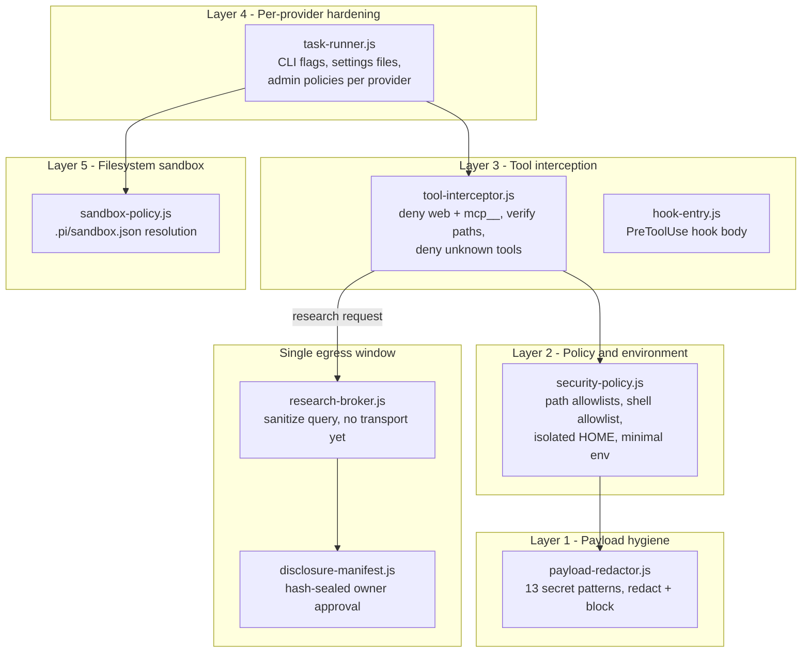

# 09 — Security Architecture

Status: V3 design. Every claim about current code cites `file:line` in this repository
(`app/`). Statements about future work are marked as design, not as existing behavior.

## 1. Scope and threat model

BigKiji Universe runs untrusted-by-default AI provider CLIs (Claude Code, Codex, Gemini,
GLM, local Ollama) as child processes against the owner's vault. The assets to protect:

| Asset | Threat |
|---|---|
| Vault contents (business data, private notes) | Exfiltration via web tools, over-broad file reads |
| API keys and credentials | Leakage into prompts, into child environments, into search queries |
| Owner intent | A provider doing more than the approved task (tool misuse, prompt injection via file contents) |
| The machine itself | Arbitrary shell execution, network egress from a spawned process |

The design principle is **defense in depth with a single egress window**: a payload can
only leave the machine through one brokered, sanitized, owner-approved path — and today
even that path has no transport implementation (see §4).

## 2. Layered architecture

All five layers live in `src/domain/pi-core/security/` and `src/domain/pi-agent/`.

### Layer 1 — Payload redaction (`src/domain/pi-core/security/payload-redactor.js`, 45 lines)

- `SECRET_PATTERNS` defines 13 pattern types (`payload-redactor.js:7-24`): private keys,
  Anthropic / Z.ai / OpenAI / Google / GitHub / Slack / AWS tokens, JWTs, Authorization
  headers, named secrets, emails, phone numbers. Only `private-key` carries
  `critical: true` (`payload-redactor.js:8`); a critical finding blocks the payload
  outright rather than merely redacting it (`payload-redactor.js:33`).
- `redactPayload()` (`payload-redactor.js:26-35`) replaces matches with
  `<REDACTED:type>` and returns findings with counts.
- `sanitizeSearchQuery()` (`payload-redactor.js:37-43`) additionally strips code fences,
  rewrites filesystem paths to `<PATH>`, caps queries at 320 chars, and blocks any query
  with more than 4 code signals or a surviving `<PATH>` marker.

### Layer 2 — Policy and environment (`src/domain/pi-core/security/security-policy.js`, 117 lines)

- `normalize()` (`security-policy.js:44-68`) produces the canonical policy object:
  canonical read/write roots, `webSearch: 'broker-only'` (`:56`),
  `unknownTools: 'deny'` (`:57`), a shell-command allowlist of five verification-only
  regexes (`:58-64`), and a `policyHash` over the whole object (`:66`) so the disclosure
  manifest can prove which policy was in force.
- `assertPath()` (`security-policy.js:70-77`) canonicalizes (realpath) the target,
  rejects sensitive segments/files (`.env`, `.ssh`, credentials, key files —
  `security-policy.js:17-18`), then requires the target to be inside an allowlisted root.
- `createRuntime()` (`security-policy.js:79-86`) creates a per-task throwaway runtime
  under the OS tmpdir with mode `0700`, including an **isolated HOME** — the child never
  sees the real home directory.
- `minimalEnv()` (`security-policy.js:88-114`) builds the child environment from scratch
  rather than inheriting the parent's: PATH (plus known bin dirs that actually exist),
  locale, TERM, the isolated HOME/TMPDIR/XDG dirs, and **exactly one provider secret**
  — the key named in `PROVIDER_SECRET` for that provider (`security-policy.js:9-15`,
  injection at `:111-112`). A Codex child never receives the Anthropic key.

### Layer 3 — Tool interception (`src/domain/pi-core/security/tool-interceptor.js`, 50 lines)

`decide()` (`tool-interceptor.js:17-41`) is deny-by-default:

- Web tools and **any `mcp__*` tool are denied immediately**
  (`tool-interceptor.js:21`).
- Read tools: every candidate path must pass `assertPath` (`:22-26`).
- Write tools: a path is mandatory and must be inside an approved write root (`:27-31`).
- Shell: network/dynamic-code commands (`curl`, `wget`, `ssh`, `nc`, `osascript`,
  `python -c`, …) are denied (`:34`), shell metacharacters `| ; & > < \`` and `$(`
  are denied (`:35`), and the command must match the policy allowlist (`:36`).
- Anything unrecognized is denied (`:40`).

`hook-entry.js` (18 lines) is the executable body wired into Claude Code's PreToolUse
hook, so the interceptor runs inside the provider's own tool loop.

### Layer 4 — Per-provider hardening (`src/domain/pi-agent/task-runner.js`)

The same MCP/web denial is enforced redundantly at the CLI boundary, per provider:

- **Claude / claude-code**: a generated settings file denies
  `WebSearch, WebFetch, mcp__.*` and installs the PreToolUse hook
  (`task-runner.js:246-248`); an **empty** `{ mcpServers: {} }` config is written
  (`:249`) and enforced with `--strict-mcp-config` (`:276`); the spawn adds
  `--allowed-tools Read,Edit,Write,Bash,Grep,Glob` and
  `--disallowed-tools WebSearch,WebFetch,mcp__.*` (`:278`).
- **Codex**: `-c web_search="disabled"` and
  `-c shell_environment_policy.inherit="none"` (`task-runner.js:283`).
- **Gemini**: a generated admin policy denies `google_web_search`, `web_fetch`,
  `activate_skill`, `invoke_agent` and shell (`task-runner.js:252-260`); settings force
  `sandboxNetworkAccess: false` and empty `mcpServers` (`:264-267`); the policy is
  attached via `--admin-policy` (`:287`).
- **GLM**: run through `pi` with `--no-tools --no-extensions --no-skills` (`:289`).
- **Qwen/Ollama**: plain local `ollama run` — no tool loop at all (`:290-291`).

There is **no MCP client implementation in the codebase today**: `package.json` has zero
`@modelcontextprotocol` dependencies (dependencies: xterm, dotenv, node-pty, qrcode,
three, ws).

### Layer 5 — Filesystem sandbox (`src/domain/pi-agent/sandbox-policy.js`, 84 lines)

`findSandbox()` (`sandbox-policy.js:22-34`) walks upward from the task cwd to the vault
root looking for `.pi/sandbox.json`, so each role folder carries its own write scope and
a task cannot escape it by choosing a different cwd.

## 3. app/ vs private/ separation

The publishable application (`app/`) and the owner's private material must never travel
together. Current enforcement:

- `.gitignore:5` excludes `.env`.
- `package.json` `build.files` excludes `!**/.env`, `!recordings/**`,
  `!graphify-out/**`, `!fixtures/**` from packaged artifacts.
- The security policy treats `.env`, `.ssh`, credentials and key files as sensitive
  paths regardless of allowlists (`security-policy.js:17-18`).

**V3 rule**: everything a provider may read lives under policy-approved roots; secrets
live only in `.env` / OS keychain territory that Layer 2 refuses to path-resolve and
Layer 1 redacts if pasted. The packaged app must remain reproducible from `app/` alone
with zero private bytes.

### Live finding (action required)

`app/.env:8` contains a **live `MOONSHOT_API_KEY` in plaintext**. It is excluded from
git (`.gitignore:5`) and from packaging (`build.files` `!**/.env`), so it does not ship
— but a live key sitting in a repository intended for publication is one `git add -f`
away from disclosure. **Recommendation: rotate this key** and keep only rotated,
runtime-injected keys in `.env`. (The key value is intentionally not reproduced here.)

## 4. Egress: the research broker

`src/domain/pi-core/security/research-broker.js` (31 lines) is the only sanctioned
window to the network. `prepare()` (`research-broker.js:13-18`) sanitizes a query via
`sanitizeSearchQuery` and returns it tagged `requiresOwnerApproval: true`;
`prepareAll()` (`:23-28`) is the batch form, and one blocked query blocks the whole
task rather than being silently dropped.

**Honest status**: the broker has **no transport**. Nothing in the codebase performs a
network call on the broker's behalf — it returns a sanitized string, and that is where
the pipeline currently ends. Egress control is therefore not "monitored"; it is
structurally absent, which is the strongest form the guarantee can take.

## 5. Disclosure manifest

`src/domain/pi-core/security/disclosure-manifest.js` (46 lines) seals what the owner
approves:

- `createDisclosureManifest()` (`disclosure-manifest.js:21-32`) records the run, the
  provider **and the model**, per-slice source files each with a fresh `sha256`
  (`:22-24`), redaction findings, normalized `externalTools` (tool + exact sanitized
  query, `:13-19`), `estimatedTokens`, a `payloadHash`, the `policyHash`, and an
  overall `disclosureHash`.
- `verifyDisclosureManifest()` (`:34-40`) **recomputes every file hash** plus the
  payload and policy hashes, so approval is void if any input changed after the owner
  saw it.

**Honest gap**: `externalTools` has plumbing and tests but **no production producer**.
The only consumer reads `task.metadata?.research || []`
(`task-runner.js:233`) and nothing in `src/` ever sets `metadata.research`. The gate
was built before any traffic exists to pass through it. The first real producer is the
V3 MCP integration below — until then, every manifest truthfully reports zero external
tool calls because zero occur.

## 6. MCP in V3 — stdio, local-only, by owner decision

**Owner decision (2026-08-02)**: the earlier plan to open external MCP broadly via the
broker is **rescinded**. V3 admits MCP only as **stdio child processes bound to trusted
local servers (127.0.0.1 / same machine)**. External MCP servers, OAuth 2.1
authorization flows, and Streamable HTTP transport are **explicitly not built**. The
`mcp__*` denial for spawned provider children (Layers 3 and 4) is **retained
unchanged** — providers never gain MCP; only the BigKiji host process itself may speak
it, to servers the owner installed.

Rationale, from the 2026-07-28 spec review (see `12-stack-2026.md` §2): the stdio
transport is newline-delimited JSON-RPC and small enough to implement without a
framework, while the HTTP transport drags in session management, resumability, and the
entire OAuth 2.1 / CIMD authorization surface — none of which buys anything for
same-machine servers.

### Implementation shape (design — does not exist yet)

Dependency-zero client: `child_process.spawn` + `readline` over the child's stdout,
newline-delimited JSON-RPC 2.0, a `Map` from request id to pending promise. No SDK.

### Threat mitigations carried into the design

| Threat (OWASP MCP Top 10 territory) | Mitigation in this design |
|---|---|
| Tool poisoning (malicious instructions hidden in tool descriptions) | Tool descriptions are rendered to the owner verbatim at install time and hashed; they are never concatenated into provider prompts |
| Rug pull (definitions change after approval) | Tool schema hash pinned at registration; every `tools/list` result re-verified against the pin, mismatch = deny + surface to owner |
| Indirect prompt injection via tool results | Tool results pass through `redactPayload` and are tagged as untrusted data before entering any model context |
| Confused deputy | Servers are launched by BigKiji with `minimalEnv`-style environments; no ambient credentials; one server, one purpose |
| Server binary drift | Only allowlisted executable paths may be spawned; the allowlist lives in the security policy and is covered by `policyHash` |

Every MCP tool invocation becomes an `externalTools` entry in the disclosure manifest —
giving §5's empty gate its first production producer, with the owner approving the
exact call by name.

## 7. Daemon and IPC surface (`src/domain/server/daemon.js`, `src/core/main.js`)

- The HTTP daemon references `url.pathname` at 38 sites (grep-verified), routing by
  exact pathname match. Auth:
  Bearer / `?t=` / cookie `bk_t` must equal the master token (`daemon.js:454`), or a
  paired device cookie `bk_mobile` (`:455`); everything else falls through a common
  401 gate (`daemon.js:471`).
- **Unauthenticated surface**: `GET /health` returns pid, dataRoot, stateRoot and app
  version without auth (`daemon.js:451-452`), and `POST /api/mobile/pair` accepts a
  pairing code without auth (`:465-468`). V3 keeps pairing but should reduce `/health`
  to a bare liveness bit — paths and pid are reconnaissance for free.
- SSE at `/api/events` (`daemon.js:573`); WebSocket upgrades require an exact token
  match or the socket is destroyed with 401 (`daemon.js:633-635`).
- Electron IPC: 12 `ipcMain.on` + 70 `ipcMain.handle` channels in `src/core/main.js`
  (grep-verified); all windows use `contextIsolation: true, nodeIntegration: false`
  (`src/core/main.js:371`, `:401`, `:1076`).

## 8. Security invariants (V3 must-hold list)

1. No spawned provider ever sees a web tool, an `mcp__*` tool, or a second provider's
   key (Layers 2-4, enforced today).
2. Any byte leaving the machine is named in a hash-sealed disclosure manifest the owner
   approved — and today, no byte leaves at all.
3. MCP servers are local, stdio-spawned, allowlisted, schema-pinned; the HTTP/OAuth
   surface of the MCP spec is out of scope.
4. `app/` packages and publishes with zero private bytes; live keys in `.env` are
   treated as incidents (one open: §3).
5. Unknown means denied — tools (`tool-interceptor.js:40`), paths
   (`security-policy.js:75`), and policies alike.

## 9. The Pi sandbox is a separate boundary, and its reference is org canon

Two different files are named `sandbox.json` and they have different readers:

| File | Read by | What it decides |
|---|---|---|
| `~/.pi/agent/sandbox.json` + each department's `.pi/sandbox.json` | the `pi-sandbox@0.6.1` package, via macOS `sandbox-exec` | what any Pi process on this machine may read, write and reach over the network |
| `app/.pi/sandbox.json` | this app's `SandboxPolicyResolver` | which vault paths a run may touch and which paid providers may be offered |

The Pi one governs every workspace, not just this app, so its reference lives in the
maintainer's vault rather than in this repository.

Two facts from it that change how policy must be written, both verified against
`pi-sandbox`'s own `README.md` and `src/config.ts:78`:

- Arrays merge as a **union**, so a project config can only ever *add* permissions —
  except `enabled`, which is a **scalar**, and scalars are won by the local file. One
  line in any project turns the sandbox off for that whole tree.
- `denyRead` is **promptable** and `allowRead` overrides it; `denyWrite` is **absolute
  and never prompted**. Read and write run in opposite directions, so anything that must
  not be touched belongs in `denyWrite`.

`npm run test:sandbox-boundary` (`tools/sandbox-boundary-selftest.js`) enforces both, plus
that the reference stays reachable from every department. It skips, rather than fails, on
a machine with no `~/.pi`.
