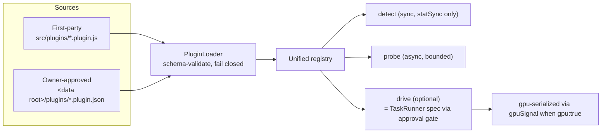

# V3 — Plugin Architecture

Status: DESIGN SPECIFICATION (V3). Constants are cited with file:line; performance
claims follow constitution rule 25 (`src/domain/pi-core/system-instructions.md:31`) —
targets are marked as targets, actuals read `not measured`.

---

## 1. What already exists (the seams V3 generalizes)

V2.5 has no plugin system, but it has four extension seams whose discipline is worth
keeping exactly as-is:

### 1.1 The tool connection registry (the model to copy)

`src/domain/pi-agent/tool-registry.js` describes eight local tools — comfyui, acestep,
ltx2, ollama, n8n, obsidian, graphify (+graph file), gpuSignal — as a **frozen
declarative table** (`TOOLS`, :133-271). Its rules are the constitution of the V3
plugin contract:

- **Detection and health are separate questions.** `detectAll()` is synchronous and
  cheap (statSync only, :9-10, :351-360); `probe()` is async, always resolves, always
  bounded by `PROBE_TIMEOUT_MS = 1200` ms (:32, :428-458). A dead port must never hang
  the settings screen (:12).
- **Three states, never collapsed:** `missing` / `found` / `connected` (:14-20, :40).
  "found" is the honest answer for installed-but-not-running, and "a status is never
  promoted without evidence: a probe that has not run reports 'not checked', never
  'connected'" (:19-20).
- **`probe: null` is a legal, honest answer.** LTX-2 is a batch job — "inventing an
  endpoint for it would be inventing health" (:178-180). gpuSignal is never executed —
  "presence on disk is all BigKiji claims to know" (:267-269).
- **Bounded everything:** graph parse refuses files > 128 MB (:33-35), HTTP bodies are
  truncated at 512 KB *before* parse (:36-38), directory search is breadth-first with
  depth/dir caps (:91-112).
- **One source of truth per path.** Three tools reuse an existing `settings.paths`
  key instead of owning a second one, "because a second key for the same thing is a
  second source of truth that can disagree with the first" (:127-132).
- **Resolution order is owner-first:** env override → saved setting → conventional
  candidates → PATH, and an explicit-but-missing path reports `missing` rather than
  silently falling back (:290-310).
- **Pure Node, no electron import**, so daemon and CLI load it too (:22-23).

### 1.2 The other three seams

- **SkillRegistry** (`src/domain/pi-agent/skill-registry.js`, `scan()` :216,
  `brief()` :281): the owner's skill files are indexed and injected as *text only*
  into assignment prompts — "This injects guidance, never filesystem access, so the
  sandbox boundary is exactly what it was before the skill registry existed"
  (`core-execution-coordinator.js:242-243`, injection at :232, :245).
- **ResearchBroker** (`src/domain/pi-core/security/research-broker.js`, used at
  `task-runner.js:15,233`): external lookups requested by a task are brokered and
  disclosed; a blocked query blocks the task rather than being dropped silently
  (`task-runner.js:230-233`).
- **Provider adapters** (`task-runner.js:271-293`): five hardcoded `adapter()`
  branches map a provider id to a command line plus sandbox flags.
- **Daemon hot-reload seam**: `reload()` clears the require cache under
  `src/extensions` and `src/hooks` only, and only with owner confirmation plus a
  current policy hash (`src/domain/server/daemon.js:393-402`).

---

## 2. V3 plugin model

### 2.1 Definition

A **plugin is a declarative descriptor file, not a package.** No npm install, no
postinstall scripts, no bundled binaries (BigKiji "never bundles, copies or installs a
tool", `tool-registry.js:4`). A plugin tells BigKiji where something the owner already
installed lives, how to check it honestly, and — optionally — how to drive it *through
the existing approval pipeline*.



### 2.2 Capability kinds

| Kind | Extends | Contract |
|---|---|---|
| `tool` | the `TOOLS` table | Same shape as an entry in `tool-registry.js:133-271`: `id, label, kind (http\|binary\|directory\|file — KINDS :41-44), settingKey, purpose, optional, env[], candidates(ctx), verify?, probe?` |
| `skill-pack` | SkillRegistry | Points at a directory of skill markdown; injection stays text-only |
| `provider` | `adapter()` | Declarative command template + sandbox flags; **must** express a deny posture equivalent to the existing five (no web, no MCP/agents, workspace-scoped writes) or it fails validation |
| `driver` | new | A named, parameterized task template (`prompt`, `cwd` policy, `write` flag, `gpu` flag) that is *submitted as an ordinary TaskRunner task* — sealed, disclosed, approved |

### 2.3 The honesty contract (inherited, non-negotiable)

1. Detection is synchronous stat-only; opening a socket during detection is a
   validation failure.
2. Every probe is bounded (default `PROBE_TIMEOUT_MS`, :32) and *always resolves*;
   a plugin cannot register a probe that can throw into the UI (`probe()` already
   wraps this, :454-457).
3. `connected` requires an executed probe with an accepted answer; `probe: null`
   plugins can never claim more than presence.
4. Status text must carry evidence (version string, host, node count — as the shipped
   probes do, e.g. :146-148, :194-198), never adjectives.

### 2.4 The security contract

1. **A plugin never executes at load or detect time.** Loading parses and validates;
   detection stats the filesystem. The only execution paths are (a) an `exec` probe of
   the plugin's own resolved binary with a timeout and `SIGKILL` (:401-410), and (b) a
   `driver` template that becomes a normal task — which means a disclosure manifest,
   `AWAITING_APPROVAL`, sandbox policy files, minimal env, redacted output
   (`task-runner.js:219-240,150-169`). There is no third path.
2. **Third-party descriptors are approved like disclosures.** A descriptor under the
   data root is inert until the owner approves its content hash in Settings; a changed
   file reverts to inert (same stale-hash philosophy as
   `core-execution-coordinator.js:198-200`). First-party descriptors in `src/plugins/`
   ship with the app and need no hash step.
3. **Fail closed, report honestly.** A descriptor that fails schema validation is
   listed in Settings as `invalid` with the reason; it never partially loads.
4. **GPU jobs serialize.** A `driver` with `gpu: true` must be wrapped by the detected
   gpuSignal arbiter when present (`tool-registry.js:256-270`); when gpuSignal is
   `missing`, the driver still runs but the run disclosure states that no arbitration
   is active — stated, not hidden.
5. **Worker tool budget is respected.** Plugins must not add tools to worker CLIs;
   the < 10 tools rule (`01-agent-mesh.md` §5d-3, currently 6 at
   `task-runner.js:278`) is a validation constant, not a convention.

### 2.5 Descriptor sketch (`tool` kind)

```js
// src/plugins/comfyui.plugin.js  — pure data + pure functions, no side effects
module.exports = Object.freeze({
  api: 1,                          // plugin API version; unknown ids/fields rejected
  id: 'comfyui', kind: 'tool',
  tool: {
    label: 'ComfyUI', pathKind: 'directory', settingKey: 'comfyRoot',
    purpose: 'Local image and 3D asset generation.', env: ['COMFYUI_ROOT'],
    candidates: (ctx) => [/* stat-only path guesses */],
    probe: { type: 'http', urls: ['http://127.0.0.1:8000/system_stats'],
             accept: (body, res, url) => /* evidence string or '' */ '' },
  },
  drivers: [{ id: 'generate', gpu: true, write: true,
              prompt: (params) => `...`, timeoutMs: 900000 }],
});
```

Loopback-only URLs are enforced by validation for `http` probes (`127.0.0.1` /
`localhost`): every shipped probe already conforms (:144, :164, :193, :211), and a
plugin that health-checks a remote host is a data-exfiltration channel, not a probe.

---

## 3. Migration plan

| Phase | Work | Risk / verification |
|---|---|---|
| 1 | Extract the eight `TOOLS` entries into `src/plugins/*.plugin.js`; `tool-registry.js` becomes loader + validator + the same exported API (`detectAll`, `probe`, `detectAndProbeAll` unchanged) | Behavior-preserving refactor; `npm run test:tools` (`tools/tool-registry-selftest.js`) must pass byte-identical statuses |
| 2 | Add descriptor schema validation + Settings surface for `invalid`/`inert` states | New selftest with a deliberately malformed descriptor; must fail closed |
| 3 | Move the five provider adapters into `provider` descriptors with a deny-posture validator | `test:security` + `test:daemon` unchanged; adapters must produce identical argv (snapshot test) |
| 4 | `driver` kind + gpuSignal wrapping + third-party hash approval under the data root | New selftest: driver task must appear as `awaiting_approval` with a manifest before any spawn |

Phases are independent; each keeps the npm dependency count at 8 (`package.json:120-129`).

---

## 4. Non-goals

- **No plugin marketplace, no auto-update, no network fetch of descriptors.** The
  owner puts a file in a folder; that is the whole distribution story.
- **No in-process plugin code execution beyond pure descriptor functions**
  (`candidates`, `accept`, `prompt` templates). No hooks into the coordinator's state
  machine, no event-bus subscriptions from third-party code.
- **No UI plugins in V3.** The renderer surface stays first-party; a plugin
  contributes at most a Settings row (generated from the descriptor) and tasks.

## 5. Targets

| Metric | Target | Actual |
|---|---|---|
| Settings open with all plugins loaded | detection stays synchronous-cheap (stat-only, as today — `tool-registry.js:9-10`) | not measured |
| Probe wall-time per tool | ≤ `PROBE_TIMEOUT_MS` + 150 ms scheduling margin (code constants, :32, :449-452) | not measured |
| Descriptor validation failures reaching runtime | 0 (fail closed at load) | not measured |
| npm dependencies added by the plugin system | 0 (hard constraint) | 0 by construction |
